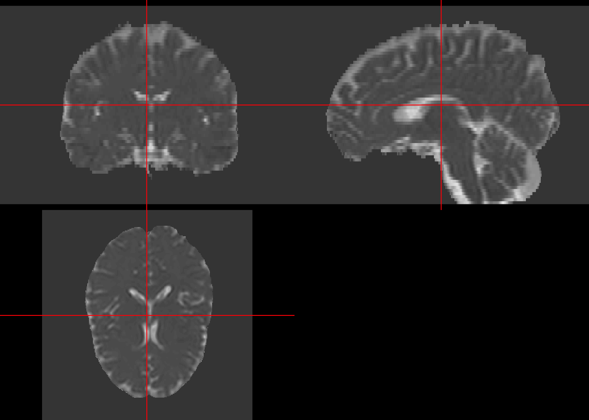
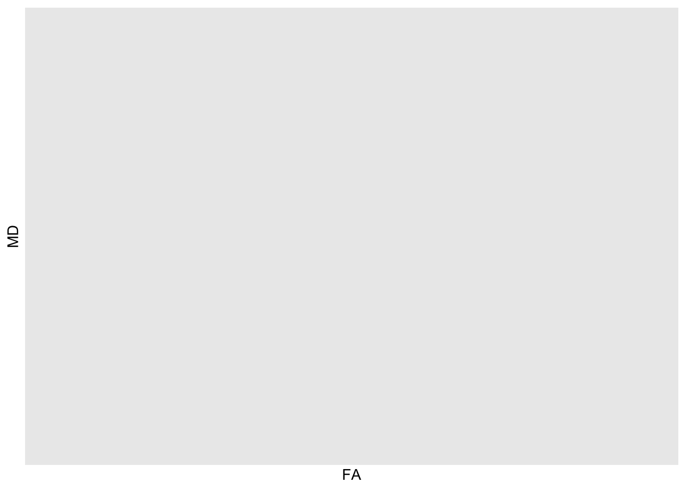

# DTI Analysis in fslr
John Muschelli  
October 3, 2016  


# Resources and Goals
Much of this work has been adapted by the FSL guide for DTI: [http://fsl.fmrib.ox.ac.uk/fsl/fslwiki/FDT/UserGuide](http://fsl.fmrib.ox.ac.uk/fsl/fslwiki/FDT/UserGuide).  We will show you a few steps that have been implemented in `fslr`: `eddy_correct` and `dtifit`.  Although `xfibres` has been adapted for `fslr`, which is the backend for `bedpostx` from FSL, it takes a long time to run and the results are not seen in this vignette, though code is given to illustrate how it would be run.


# Data Packages

For this analysis, I will use one subject from the Kirby 21 data set.  The `kirby21.base` and `kirby21.dti` packages are necessary for this analysis and have the data we will be working on.  You need devtools to install these.  Please refer to [installing devtools](../installing_devtools/index.html) for additional instructions or troubleshooting.


```r
packages = installed.packages()
packages = packages[, "Package"]
if (!"kirby21.base" %in% packages) {
  devtools::install_github("muschellij2/kirby21.base")
}
if (!"kirby21.dti" %in% packages) {
  devtools::install_github("muschellij2/kirby21.dti")
}
```

# Loading Data

We will use the `get_image_filenames_df` function to extract the filenames on our hard disk for the T1 image.  


```r
library(kirby21.dti)
library(kirby21.base)
fnames = get_image_filenames_df(ids = 113, 
                    modalities = c("T1", "DTI"), 
                    visits = c(1),
                    long = FALSE)
t1_fname = fnames$T1[1]
dti_fname = fnames$DTI[1]
base_fname = nii.stub(dti_fname, bn = TRUE)
dti_data = get_dti_info_filenames(
  ids = 113, 
  visits = c(1))
b_fname = dti_data$fname[ dti_data$type %in% "b"]
grad_fname = dti_data$fname[ dti_data$type %in% "grad"]
```


## Making b-vectors and b-values
As `dtifit` requires the b-values and b-vectors to be separated, we will take a look at this data.


```r
b_vals = readLines(b_fname)
b_vals = as.numeric(b_vals)
b0 = which(b_vals == 0)[1]

b_vecs = read.delim(grad_fname, header = FALSE)
stopifnot(all(is.na(b_vecs$V4)))
b_vecs$V4 = NULL
colnames(b_vecs) = c("x", "y", "z")
```

## Printing out FSL Version


```r
library(fslr)
print(fsl_version())
```

```
## [1] "5.0.0"
```

## Checking our data
Here we ensure that the number of b-values/b-vectors is the same as the number of time points in the 4D image.


```r
n_timepoints = fslval(dti_fname, "dim4")
```

```
## fslval "/Library/Frameworks/R.framework/Versions/3.3/Resources/library/kirby21.dti/visit_1/113/113-01-DTI.nii.gz" dim4
```

```r
stopifnot(nrow(b_vecs) == n_timepoints)
stopifnot(length(b_vals) == n_timepoints)
```


# Running `eddy_correct`
Here, we will run an eddy current correction using FSL's `eddy_correct` through `fslr`.  We will save the result in a temporary file (`outfile`), but also return the result as a `nifti` object `ret`, as `retimg = TRUE`.  We will use the first volume as the reference as is the default in FSL.  *Note* FSL is zero-indexed so the first volume is the zero-ith index:


```r
eddy_fname = paste0(base_fname, "_eddy.nii.gz")
if (!file.exists(eddy_fname)) {
  eddy = eddy_correct(
    infile = dti_fname, 
    outfile = eddy_fname, 
    retimg = TRUE, 
    reference_no = 0)
} else {
  eddy = readnii(eddy_fname)
}
```

Let's look at the eddy current-corrected (left) and the non-corrected data (right).  Here we will look at the image where the b-value is equal to zero.  


```r
dti = readnii(dti_fname)
eddy0 = extrantsr::subset_4d(eddy, b0)
dti0 = extrantsr::subset_4d(dti, b0)
```


```r
double_ortho(robust_window(eddy0), robust_window(dti0))
```

<!-- -->

Note, from here on forward we will use either the filename for the output of the eddy current correction or the eddy-current-corrected `nifti` object.

# Getting a brain mask

Let's get a brain mask from the eddy-corrected data:


```r
mask_fname = paste0(base_fname, "_mask.nii.gz")
if (!file.exists(mask_fname)) {
  fsl_bet(infile = dti0, outfile = mask_fname)
} 
mask = readnii(mask_fname)
```


```r
ortho2(robust_window(dti0), mask, col.y = alpha("red", 0.5))
```

<!-- -->


# Running DTI Fitting as a cursor

Now that we have eddy current corrected our data, we can pass that result into `dtifit` to get FA maps and such:

```r
outprefix = base_fname
suffixes = c(paste0("V", 1:3),
             paste0("L", 1:3),
             "MD", "FA", "MO", "S0")
outfiles = paste0(outprefix, "_", 
                  suffixes, get.imgext())
names(outfiles) = suffixes
if (!all(file.exists(outfiles))) {
  res = dtifit(infile = eddy_fname, 
               bvecs = as.matrix(b_vecs),
               bvals = b_vals, 
               mask = mask_fname,
               outprefix = outprefix)
}
```

By default, the result of `dtifit` is the filenames of the resultant images.  Here we will read in those images:

```r
res_imgs = lapply(outfiles[c("FA", "MD")], readnii)
```

## Plotting an FA map
Using the `ortho2` function, you can plot the fractional anisotropy (FA) map

```r
ortho2(res_imgs$FA)
```

<!-- -->

and the mean diffusivity (MD) map:

```r
ortho2(res_imgs$MD)
```

<!-- -->

or both at the same time using the `double_ortho` function:

```r
double_ortho(res_imgs$FA, res_imgs$MD)
```

<!-- -->

You can look at a scatterplot of the FA vs MD values of all values inside the mask using the following code:

```r
mask = readnii(mask_fname)
df = data.frame(FA = res_imgs$FA[ mask == 1], 
                MD = res_imgs$MD[ mask == 1] )
ggplot(df, aes(x = FA, y = MD)) + stat_binhex()
```

<!-- -->

```r
rm(list = "df")
rm(list = "mask")
```

# Fitting bedpostx

Accoriding to [http://fsl.fmrib.ox.ac.uk/fsl/fslwiki/FDT/UserGuide](http://fsl.fmrib.ox.ac.uk/fsl/fslwiki/FDT/UserGuide), the `bedpostx` function from FSL stands for "Bayesian Estimation of Diffusion Parameters Obtained using Sampling Techniques. The X stands for modelling Crossing Fibres".  It also states "bedpostx takes about 15 hours to run".  We have implemented `xfibres`, the function `bedpostx` calls.  Running it with the default options, the command would be:


```r
xfibres(infile = outfile, 
        bvecs = b_vecs,
        bvals = b_vals,
        mask = mask_fname)
```
        
We are currently implementing `probtracx2` and an overall wrapper for all these functions to work as a pipeline.
