# Brain Extraction/Segmentation
John Muschelli  
`r Sys.Date()`  


All code for this document is located at [here](https://raw.githubusercontent.com/muschellij2/neuroc/master/brain_extraction/index.R).

In this tutorial we will discuss performing brain segmentation using the brain extraction tool (BET) in `fsl` and a robust version using a wrapper function in `extrantsr`, `fslbet_robust`. 

# Data Packages

For this analysis, I will use one subject from the Kirby 21 data set.  The `kirby21.base` and `kirby21.fmri` packages are necessary for this analysis and have the data we will be working on.  You need devtools to install these.  Please refer to [installing devtools](../installing_devtools/index.html) for additional instructions or troubleshooting.


```r
packages = installed.packages()
packages = packages[, "Package"]
if (!"kirby21.base" %in% packages) {
  devtools::install_github("muschellij2/kirby21.base")
}
if (!"kirby21.t1" %in% packages) {
  devtools::install_github("muschellij2/kirby21.t1")
}
```

## Loading Data

We will use the `get_image_filenames_df` function to extract the filenames on our hard disk for the T1 image.  


```r
library(kirby21.t1)
library(kirby21.base)
fnames = get_image_filenames_df(ids = 113, 
                    modalities = c("T1"), 
                    visits = c(1),
                    long = FALSE)
t1_fname = fnames$T1[1]
```

# T1 image

Let's take a look at the T1-weighted image.  


```r
t1 = readnii(t1_fname)
ortho2(t1)
```

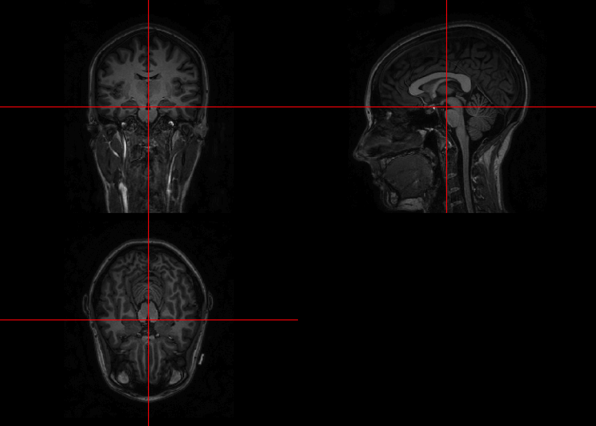<!-- -->

```r
rm(list = "t1")
```

Here we see the brain and other parts of the image are present.  Most notably, the neck of the subject was imaged.  Sometimes this can cause problems with segmentation and image registration.  

# Attempt 1: Brain Extraction of T1 image using BET

Here we will use FSL's Brain Extraction Tool (BET) to extract the brain tissue from the rest of the image.  


```r
library(fslr)
outfile = nii.stub(t1_fname, bn = TRUE)
outfile = paste0(outfile, "_SS_Naive.nii.gz")
if (!file.exists(outfile)) {
  ss_naive = fslbet(infile = t1_fname, outfile = outfile)
} else {
  ss_naive = readnii(outfile)
}
```


```r
ortho2(ss_naive)
```

<!-- -->

We see that naively, BET does not perform well for this image.

# Brain Extraction of T1 image using BET

Here we will use FSL's Brain Extraction Tool (BET) to extract the brain tissue from the rest of the image.  We use the modification of BET in `extrantsr`, which is called through `fslbet_robust`.  In `fslbet_robust`, the image is corrected using the N4 inhomogeneity correction.  The neck of the T1 image is then removed and then BET is run, the center of gravity (COG) is estimated, and BET is run with this new COG.  We used a procedure where the neck is removed in 2 registration steps, which is more robust than just the one (which is the default).


```r
outfile = nii.stub(t1_fname, bn = TRUE)
outfile = paste0(outfile, "_SS.nii.gz")
if (!file.exists(outfile)) {
  ss = extrantsr::fslbet_robust(t1_fname, 
    remover = "double_remove_neck",
    outfile = outfile)
} else {
  ss = readnii(outfile)
}
```

Let's look at the skull-stripped image.

```r
ortho2(ss)
```

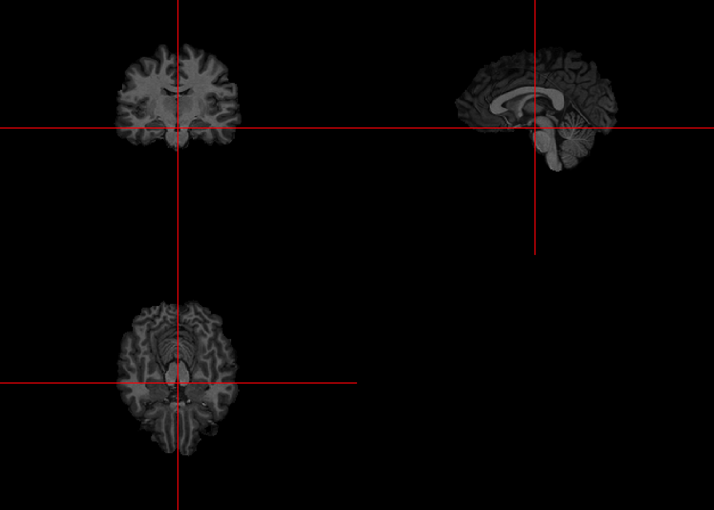<!-- -->

Here we see the skull-stripped image.  But did we drop out "brain areas"?


```r
alpha = function(col, alpha = 1) {
  cols = t(col2rgb(col, alpha = FALSE)/255)
  rgb(cols, alpha = alpha)
}      
ortho2(t1_fname, ss > 0, col.y = alpha("red", 0.5))
```

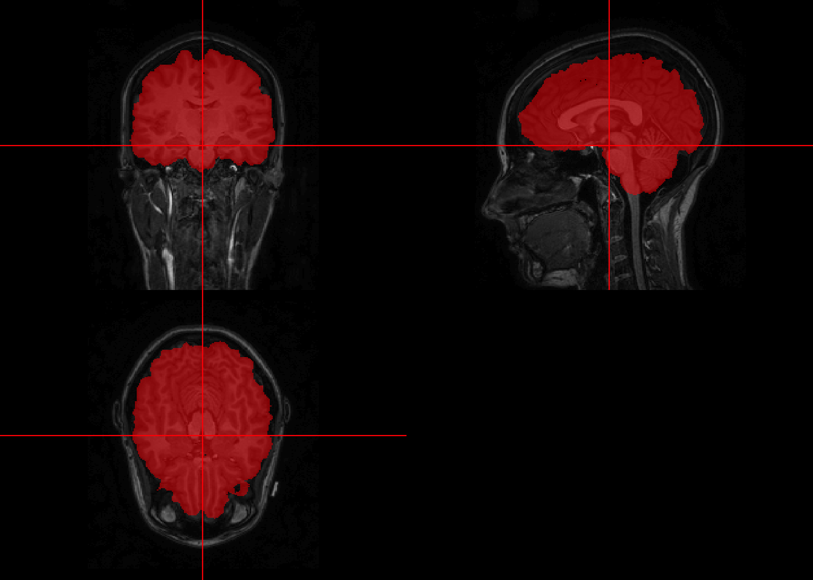<!-- -->

We can again use `dropEmptyImageDimensions` to remove extraneous slices, which helps with reducing storage of the image on disk, zooming in while plotting, and may aid registration.  


```r
ss_red = dropEmptyImageDimensions(ss)
ortho2(ss_red)
```

<!-- -->

Again, we can see the zoomed-in view of the image now.
 
# Brain Extraction of T1 image using SPM

Note, to use SPM12, you must have MATLAB.  We will use the `spm12r` package, which calls the `matlabr` package to call SPM functions within MATLAB.  


```r
library(spm12r)
```

The `spm12_segment` function takes in the original image and will perform segmentation on the entire image (background, skull, etc).  The result of `spm12_segment` is a list of length 6 with a probability for each tissue type.  The order of them is gray matter (GM), white matter (WM), and cerebrospinal fluid (CSF).  We will create a brain mask from these first 3 classes.  We can convert the probabilities to a hard segmentation using `spm_probs_to_seg`, which takes the maximum class probability to assign the class for each voxel.  There are additional options for ties, but the default is to use the first class (GM > WM > CSF).  


```r
outfile = nii.stub(t1_fname, bn = TRUE)
spm_prob_files = paste0(outfile,
                        "_prob_", 1:6,
                        ".nii.gz")
ss_outfile = paste0(outfile, "_SPM_SS.nii.gz")
outfile = paste0(outfile, "_SPM_Seg.nii.gz")
outfiles = c(outfile, ss_outfile, spm_prob_files)
if (!all(file.exists(outfiles))) {
  spm_seg = spm12_segment(t1_fname)$outfiles
  spm_hard_seg = spm_probs_to_seg(img = spm_seg)
  writenii(spm_hard_seg, filename = outfile)
  
  spm_ss = spm_hard_seg >= 1 & spm_hard_seg <= 3
  writenii(spm_ss, filename = ss_outfile)
  
  for (i in seq_along(spm_seg)) {
    writenii(spm_seg[[i]], spm_prob_files[i]) 
  }  
} else {
  spm_seg = vector(mode = "list", 
                   length = length(spm_prob_files))
  for (i in seq_along(spm_seg)) {
    spm_seg[[i]] = readnii(spm_prob_files[i]) 
  }
  spm_hard_seg = readnii(outfile)
  spm_ss = readnii(ss_outfile)
}
```

## Results of SPM Tissue Segmentation


```r
double_ortho(t1_fname, spm_hard_seg)
```

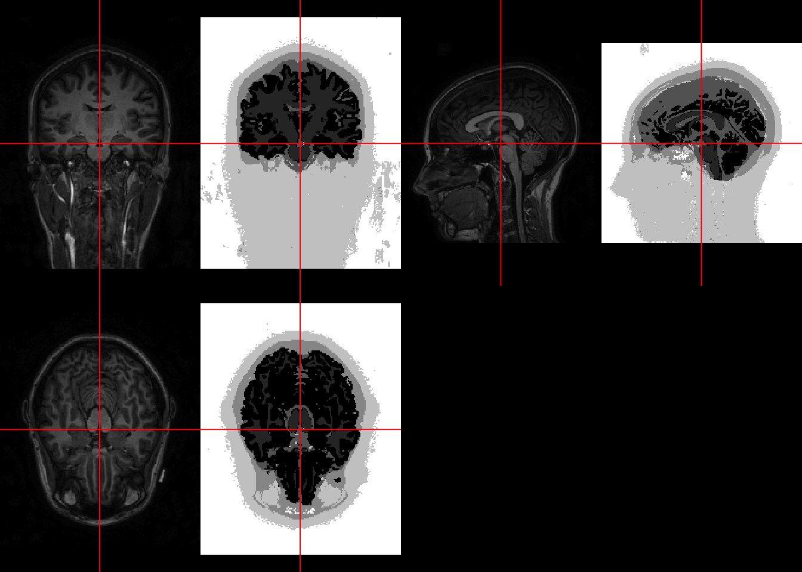<!-- -->

## Results of SPM Brain Segmentation
Here we will show again the T1 image with the corresponding skull stripped mask in red.  


```r
alpha = function(col, alpha = 1) {
  cols = t(col2rgb(col, alpha = FALSE)/255)
  rgb(cols, alpha = alpha)
}      
ortho2(t1_fname, spm_ss > 0, col.y = alpha("red", 0.5))
```

<!-- -->


## Additional Preprocessing to do

We can also remove the neck of the image and rerun the segmentation.  We will run the `double_remove_neck` function to perform this.


```r
outfile = nii.stub(t1_fname, bn = TRUE)
outfile = paste0(outfile,
                 "_noneck.nii.gz")
if (!file.exists(outfile)) {
  noneck = extrantsr::double_remove_neck(
    t1_fname,
    template.file = file.path(fslr::fsldir(), "data/standard",
                              "MNI152_T1_1mm_brain.nii.gz"), 
    template.mask = file.path(fslr::fsldir(),
                              "data/standard", 
                              "MNI152_T1_1mm_brain_mask.nii.gz"))
  writenii(noneck, filename = outfile)
} else {
  noneck = readnii(outfile)
}
```

Here we see that most of the neck was truly removed from the original image.


```r
double_ortho(t1_fname, noneck)
```

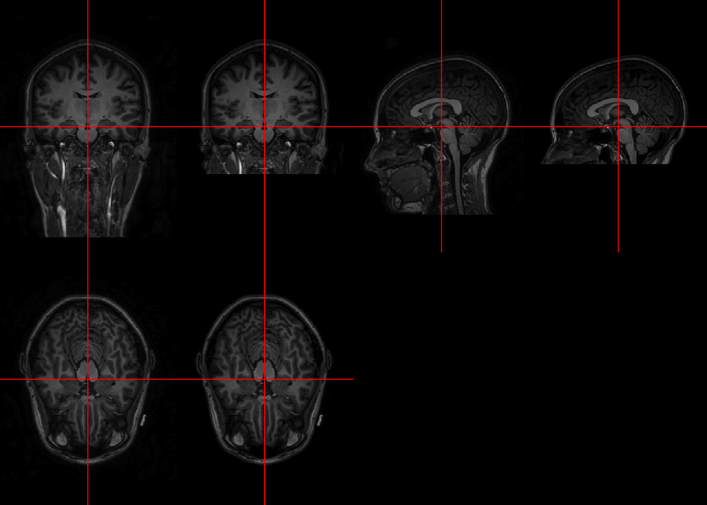<!-- -->

### Dropping empty image dimensions

Now we will drop the neck slices using `dropEmptyImageDimensions` again:


```r
noneck_red = dropEmptyImageDimensions(noneck)
ortho2(noneck_red)
```

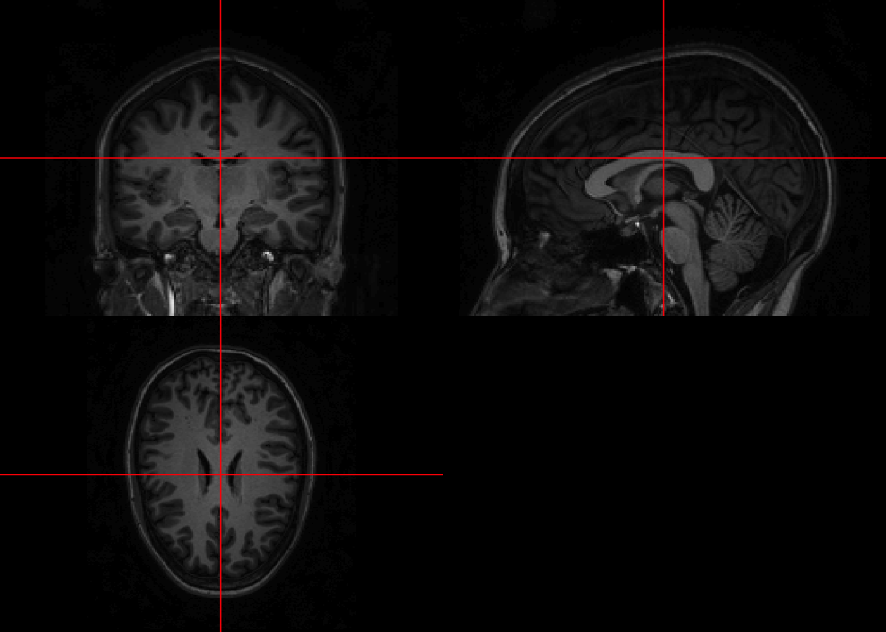<!-- -->


```r
library(spm12r)
outfile = nii.stub(t1_fname, bn = TRUE)
outfile = paste0(outfile, "_noneck")
spm_prob_files = paste0(outfile,
                        "_prob_", 1:6,
                        ".nii.gz")
ss_outfile = paste0(outfile, "_SPM_SS.nii.gz")
outfile = paste0(outfile, "_SPM_Seg.nii.gz")
outfiles = c(outfile, ss_outfile, spm_prob_files)
if (!all(file.exists(outfiles))) {
  nn_spm_seg = spm12_segment(noneck_red)$outfiles
  nn_spm_hard_seg = spm_probs_to_seg(img = nn_spm_seg)
  writenii(nn_spm_hard_seg, filename = outfile)
  
  nn_spm_ss = nn_spm_hard_seg >= 1 & nn_spm_hard_seg <= 3
  writenii(nn_spm_ss, filename = ss_outfile)
  
  for (i in seq_along(nn_spm_seg)) {
    writenii(nn_spm_seg[[i]], spm_prob_files[i]) 
  }  
} else {
  nn_spm_seg = vector(mode = "list", 
                   length = length(spm_prob_files))
  for (i in seq_along(nn_spm_seg)) {
    nn_spm_seg[[i]] = readnii(spm_prob_files[i]) 
  }
  nn_spm_hard_seg = readnii(outfile)
  nn_spm_ss = readnii(ss_outfile)
}
```

## Results of SPM Tissue Segmentation


```r
double_ortho(noneck_red, nn_spm_hard_seg)
```

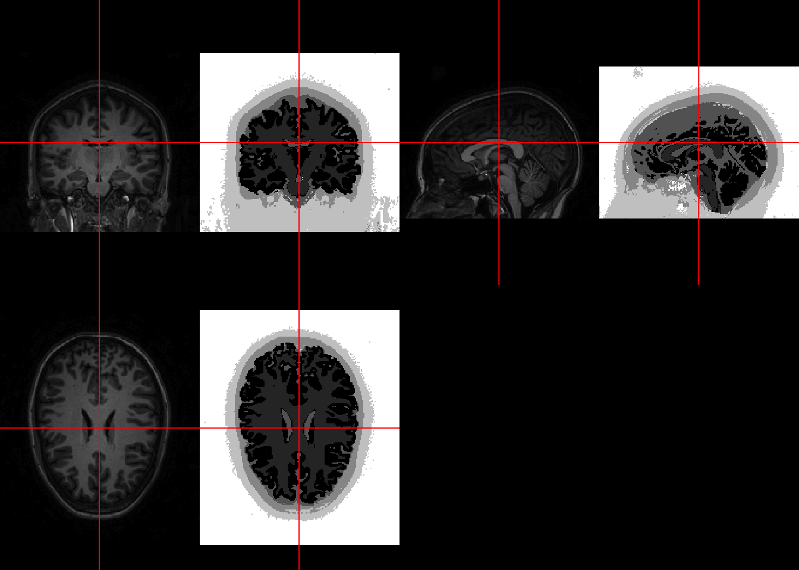<!-- -->


## Results of SPM Brain Segmentation
Here we will show again the T1 image with the corresponding skull stripped mask in red.  


```r
ortho2(noneck_red, nn_spm_ss > 0, col.y = alpha("red", 0.5))
```

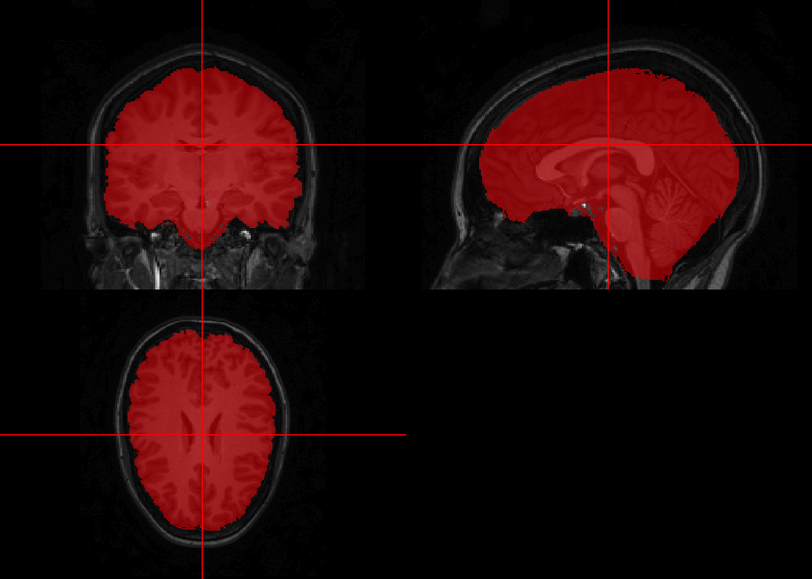<!-- -->

In order to compare this segmentation to that of the full brain, we must make the dimensions equal again.  We will use the `replace_dropped_dimensions` to do this.


```r
dd = dropEmptyImageDimensions(noneck, keep_ind = TRUE)
nn_spm_ss_full = replace_dropped_dimensions(img = nn_spm_ss,
                                            inds = dd$inds,
                                            orig.dim = dd$orig.dim)
```


```r
ortho2(t1_fname, nn_spm_ss_full, col.y = alpha("red", 0.5))
```

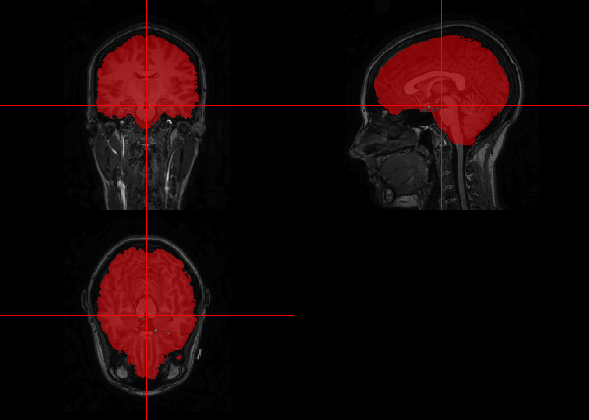<!-- -->

Here, if we assume the original skull stripped image as the gold standard and the one from the neck removal as another "prediction", we can look at the differences.  Anywhere they both agree (both are a 1) it will be deemed a true positive and will be in green.  Anywhere the neck-removed segmentation includes a voxel but the neck-included segmentation did not, it will deemed a false positive and will be in blue, vice versa in red will be a false negative.


```r
ortho_diff(t1_fname, pred = nn_spm_ss_full, roi = spm_ss)
```

```
Warning in max(img, na.rm = TRUE): no non-missing arguments to max;
returning -Inf
```

```
Warning in min(img, na.rm = TRUE): no non-missing arguments to min;
returning Inf
```

```
Warning in max(img, na.rm = TRUE): no non-missing arguments to max;
returning -Inf
```

```
Warning in min(img, na.rm = TRUE): no non-missing arguments to min;
returning Inf
```

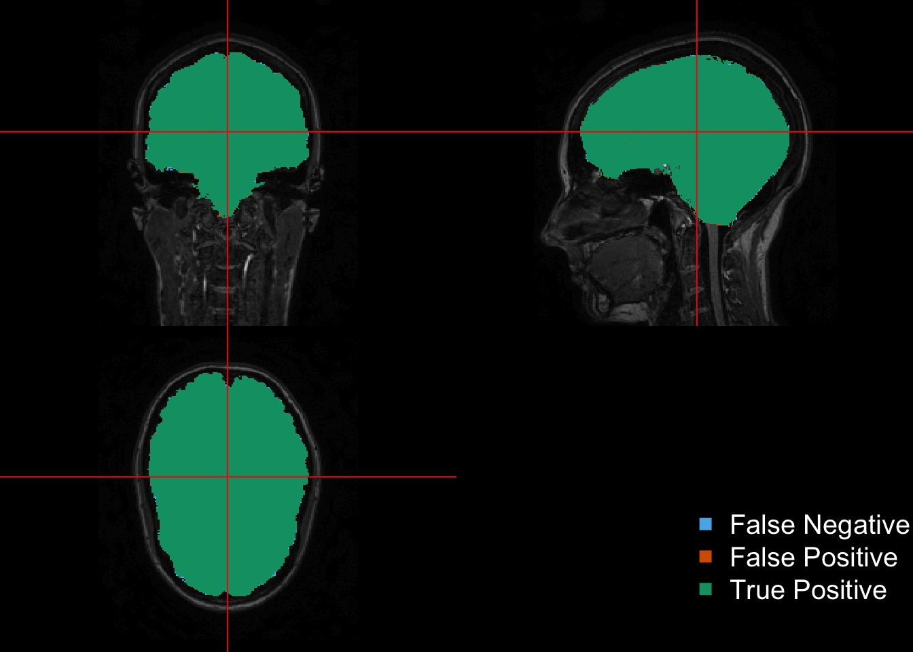<!-- -->

Here we see that for brain segmentation, there was not a large effect of removing the neck.

# Comparison of BET and SPM

Here we will compare the results from SPM and BET similarly to those above.  Just for simplicity and comparison above, we will use the "prediction" as the BET skull-stripped mask and keep the SPM image as the "gold standard"/"truth" to keep the interpretation of the colors the same.  Just insert "BET" above instead of "neck-removed segmentation".  


```r
ortho_diff(t1_fname, pred = ss, roi = spm_ss)
```

```
Warning in max(img, na.rm = TRUE): no non-missing arguments to max;
returning -Inf
```

```
Warning in min(img, na.rm = TRUE): no non-missing arguments to min;
returning Inf
```

```
Warning in max(img, na.rm = TRUE): no non-missing arguments to max;
returning -Inf
```

```
Warning in min(img, na.rm = TRUE): no non-missing arguments to min;
returning Inf
```

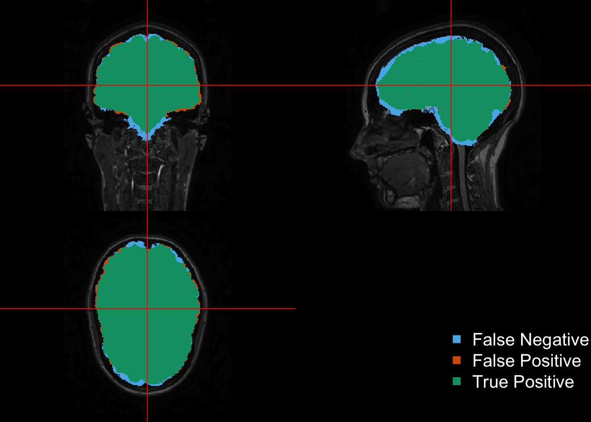<!-- -->

We see that the SPM segmentation includes some of the extracranial CSF, is a bit "smoother" on the surface, and includes some areas towards the bottom of the brain near the brain stem (more CSF).  We also see on some areas of the surface, BET includes these as brain whereas SPM does not. If you are to compare the volume of the "brain" (in quotes because that may include non-tissue as CSF), you must keep these things in mind.


# Session Info


```r
devtools::session_info()
```

```
Session info --------------------------------------------------------------
```

```
 setting  value                       
 version  R version 3.3.1 (2016-06-21)
 system   x86_64, darwin13.4.0        
 ui       X11                         
 language (EN)                        
 collate  en_US.UTF-8                 
 tz       America/New_York            
 date     2016-11-09                  
```

```
Packages ------------------------------------------------------------------
```

```
 package      * version date       source                              
 abind          1.4-5   2016-07-21 cran (@1.4-5)                       
 animation    * 2.4     2015-08-16 CRAN (R 3.2.0)                      
 ANTsR        * 0.3.3   2016-10-10 Github (stnava/ANTsR@a50e986)       
 assertthat     0.1     2013-12-06 CRAN (R 3.2.0)                      
 bitops         1.0-6   2013-08-17 CRAN (R 3.2.0)                      
 codetools      0.2-14  2015-07-15 CRAN (R 3.3.1)                      
 colorout     * 1.1-0   2015-04-20 Github (jalvesaq/colorout@1539f1f)  
 colorspace     1.2-6   2015-03-11 CRAN (R 3.2.0)                      
 DBI            0.5-1   2016-09-10 CRAN (R 3.3.0)                      
 devtools       1.12.0  2016-06-24 CRAN (R 3.3.0)                      
 digest         0.6.10  2016-08-02 cran (@0.6.10)                      
 dplyr        * 0.5.0   2016-06-24 CRAN (R 3.3.0)                      
 evaluate       0.9     2016-04-29 CRAN (R 3.2.5)                      
 extrantsr    * 2.5     2016-10-31 local                               
 formatR        1.4     2016-05-09 CRAN (R 3.2.5)                      
 fslr         * 2.4     2016-11-04 Github (muschellij2/fslr@7ce0f03)   
 ggplot2      * 2.1.0   2016-03-01 CRAN (R 3.3.0)                      
 git2r          0.15.0  2016-05-11 CRAN (R 3.3.0)                      
 gtable         0.2.0   2016-02-26 CRAN (R 3.2.3)                      
 hash           2.2.6   2013-02-21 CRAN (R 3.2.0)                      
 htmltools      0.3.6   2016-09-26 Github (rstudio/htmltools@6996430)  
 igraph         1.0.1   2015-06-26 CRAN (R 3.2.0)                      
 iterators      1.0.8   2015-10-13 CRAN (R 3.2.0)                      
 kirby21.base * 1.4.2   2016-10-05 local                               
 kirby21.fmri * 1.4     2016-09-29 local (@1.4)                        
 kirby21.t1   * 1.4     2016-09-29 local                               
 knitr          1.14    2016-08-13 CRAN (R 3.3.0)                      
 lattice        0.20-34 2016-09-06 CRAN (R 3.3.0)                      
 magrittr       1.5     2014-11-22 CRAN (R 3.2.0)                      
 matlabr        1.1.3   2016-07-12 Github (muschellij2/matlabr@57d5408)
 Matrix         1.2-7.1 2016-09-01 CRAN (R 3.3.0)                      
 matrixStats  * 0.51.0  2016-10-09 cran (@0.51.0)                      
 memoise        1.0.0   2016-01-29 CRAN (R 3.2.3)                      
 mgcv           1.8-15  2016-09-14 CRAN (R 3.3.0)                      
 mmap           0.6-12  2013-08-28 CRAN (R 3.3.0)                      
 munsell        0.4.3   2016-02-13 CRAN (R 3.2.3)                      
 neurobase    * 1.5.1   2016-11-04 local                               
 neuroim        0.1.0   2016-09-27 local                               
 nlme           3.1-128 2016-05-10 CRAN (R 3.3.1)                      
 oro.nifti    * 0.6.2   2016-11-04 Github (bjw34032/oro.nifti@fe54c8e) 
 plyr           1.8.4   2016-06-08 CRAN (R 3.3.0)                      
 R.matlab       3.6.0   2016-07-05 CRAN (R 3.3.0)                      
 R.methodsS3  * 1.7.1   2016-02-16 CRAN (R 3.2.3)                      
 R.oo         * 1.20.0  2016-02-17 CRAN (R 3.2.3)                      
 R.utils      * 2.4.0   2016-09-14 cran (@2.4.0)                       
 R6             2.2.0   2016-10-05 cran (@2.2.0)                       
 RColorBrewer * 1.1-2   2014-12-07 CRAN (R 3.2.0)                      
 Rcpp           0.12.7  2016-09-05 cran (@0.12.7)                      
 reshape2     * 1.4.1   2014-12-06 CRAN (R 3.2.0)                      
 rmarkdown      1.1     2016-10-16 CRAN (R 3.3.1)                      
 RNifti         0.2.2   2016-10-02 cran (@0.2.2)                       
 scales         0.4.0   2016-02-26 CRAN (R 3.2.3)                      
 spm12r       * 2.0     2016-09-28 CRAN (R 3.3.0)                      
 stringi        1.1.1   2016-05-27 CRAN (R 3.3.0)                      
 stringr        1.1.0   2016-08-19 cran (@1.1.0)                       
 tibble         1.2     2016-08-26 CRAN (R 3.3.0)                      
 WhiteStripe    2.0     2016-09-28 local                               
 withr          1.0.2   2016-06-20 CRAN (R 3.3.0)                      
 yaImpute       1.0-26  2015-07-20 CRAN (R 3.2.0)                      
 yaml           2.1.13  2014-06-12 CRAN (R 3.2.0)                      
 zoo          * 1.7-13  2016-05-03 CRAN (R 3.2.4)                      
```
