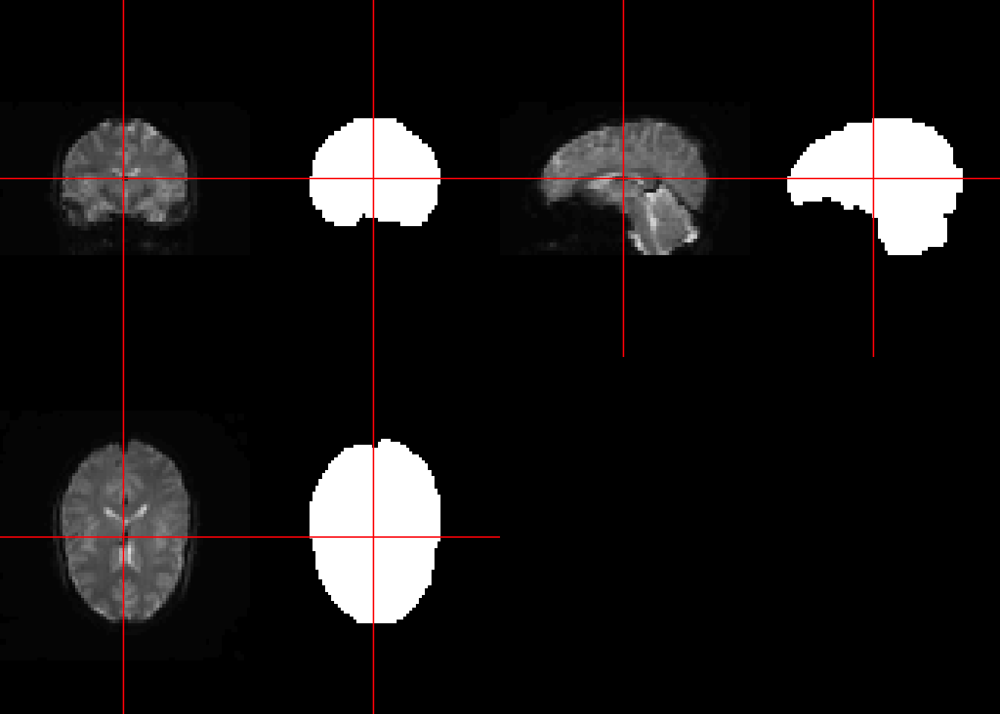
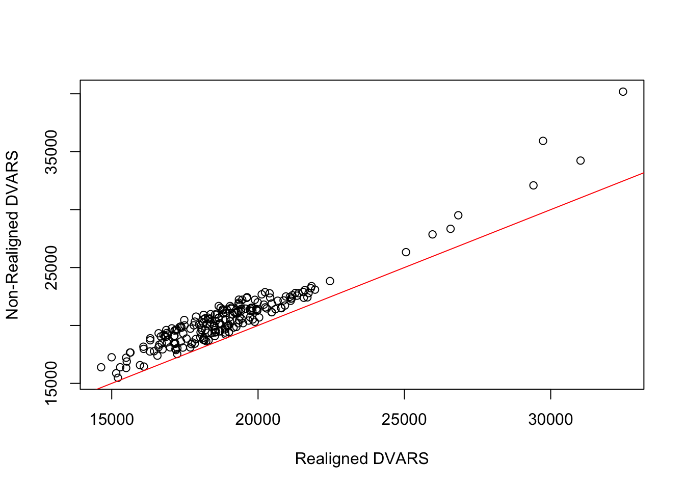
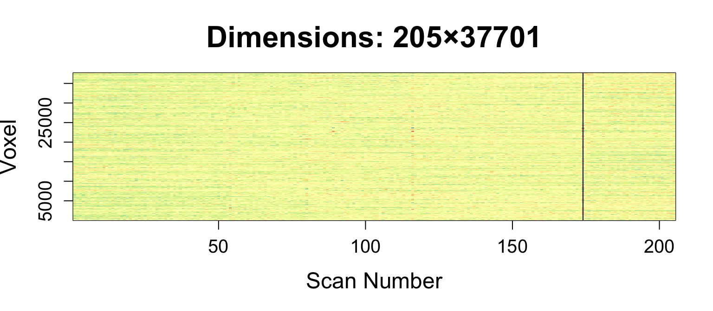
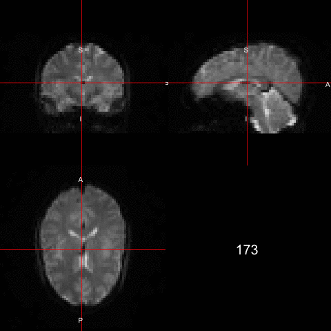
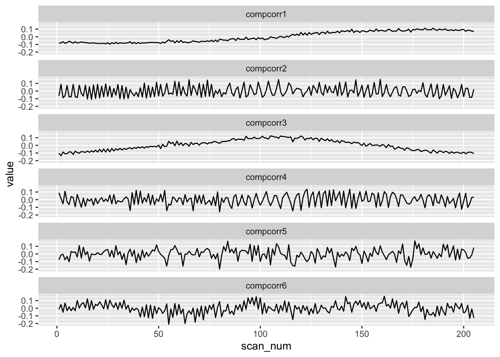

# An example of an fMRI analysis in ANTsR
John Muschelli  
October 3, 2016  


In this tutorial we will discuss performing some preprocessing of a single subject functional MRI in FSL.  

# Data Packages

For this analysis, I will use one subject from the Kirby 21 data set.  The `kirby21.base` and `kirby21.fmri` packages are necessary for this analysis and have the data we will be working on.  You need devtools to install these.  Please refer to [installing devtools](../installing_devtools/index.html) for additional instructions or troubleshooting.


```r
packages = installed.packages()
packages = packages[, "Package"]
if (!"kirby21.base" %in% packages) {
  devtools::install_github("muschellij2/kirby21.base")
}
if (!"kirby21.fmri" %in% packages) {
  devtools::install_github("muschellij2/kirby21.fmri")
}
```

# Loading Data

We will use the `get_image_filenames_df` function to extract the filenames on our hard disk for the T1 image and the fMRI images (4D).  


```r
library(kirby21.fmri)
library(kirby21.base)
fnames = get_image_filenames_df(ids = 113, 
                    modalities = c("T1", "fMRI"), 
                    visits = c(1),
                    long = FALSE)
t1_fname = fnames$T1[1]
fmri_fname = fnames$fMRI[1]
```

## Parameter file

If you'd like to see the header information from the fMRI data, it is located by the following commands:


```r
library(R.utils)
par_file = system.file("visit_1/113/113-01-fMRI.par.gz", 
                       package = "kirby21.fmri")
# unzip it
con = gunzip(par_file, temporary = TRUE, 
             remove = FALSE, overwrite = TRUE)
info = readLines(con = con)
info[11:23]
```

```
 [1] ".    Protocol name                      :   WIP Bold_Rest SENSE"
 [2] ".    Series Type                        :   Image   MRSERIES"   
 [3] ".    Acquisition nr                     :   11"                 
 [4] ".    Reconstruction nr                  :   1"                  
 [5] ".    Scan Duration [sec]                :   434"                
 [6] ".    Max. number of cardiac phases      :   1"                  
 [7] ".    Max. number of echoes              :   1"                  
 [8] ".    Max. number of slices/locations    :   37"                 
 [9] ".    Max. number of dynamics            :   210"                
[10] ".    Max. number of mixes               :   1"                  
[11] ".    Patient position                   :   Head First Supine"  
[12] ".    Preparation direction              :   Anterior-Posterior" 
[13] ".    Technique                          :   FEEPI"              
```

From the paper ["Multi-parametric neuroimaging reproducibility: A 3-T resource study"](http://dx.doi.org/10.1016/j.neuroimage.2010.11.047), which this data is based on, it describes the fMRI sequence:

> The sequence used for resting state functional connectivity MRI is typically identical to that used for BOLD functional MRI studies of task activation. Here, we used a 2D EPI sequence with SENSE partial-parallel imaging acceleration to obtain 3 × 3 mm (80 by 80 voxels) in-plane resolution in thirty-seven 3 mm transverse slices with 1 mm slice gap. An ascending slice order with TR/TE = 2000/30 ms, flip angle of 75°, and SENSE acceleration factor of 2 were used. SPIR was used for fat suppression. This study used an ascending slice acquisition order because a pilot studies revealed smaller motion induced artifacts with ascending slice order than with interleaved slice order. While using an ascending slice order, it was necessary to use a small slice gap to prevent cross talk between the slices. One 7-min run was recorded which provided 210 time points (discarding the first four volumes to achieve steady state).


# Outline 
The steps I will perform in this analysis:

1. Calculation of Motion Parameters (`fslr::mcflirt`)
1. Slice timing correction (`fslr::fsl_slicetimer`), but we need to know how the scan was taken/slice order and repetition time (TR)
2. Motion Correction on Corrected Data (`fslr::mcflirt`)
3. Coregistration of fMRI and a T1-weighted image (`fslr::flirt`)
4. Registration to the Template space (`fslr::fnirt_with_affine` )
6. Skull stripping (fslr::fslbet)
7. Registration to a template using the T1 and then transforming the fMRI with it
8. Spatially smoothing the data (fslr:fslsmooth)
9. Tissue-class segmentation (fslr::fast, ANTsR::atropos or extrantsr::otropos)?
10. Bandpass/butterworth filtering (signal::butter, signal::buttord)
11. Get a connectivity matrix of certain regions, you need to specify an atlas.


Now we know that the head is first in (as usual) and the data was acquired in ascending order (i.e. bottom -> up) and the repetition time (TR) was 2 seconds   The 


```r
library(neurobase)
fmri = readnii(fmri_fname)
ortho2(fmri, w = 1, add.orient = FALSE)
```

<!-- -->

```r
rm(list = "fmri") # just used for cleanup 
```

## Side note

Throughout this tutorial, I may be re-reading in data using `antsImageRead`.  This is due to the nature of the `antsImage` class.  It represents the data as a pointer in memory.  As I'm running RMarkdown and knitting the document, different chunks are necessarily going to keep the pointers, especially if one chunk was run in one session and then R was restarted.   It's a somewhat technical issue, but that is why I keep calling `antsImageRead` even when it seems as though that object is in memory in an earlier code chunk.

# Stabilization of Signal

Volumes corresponding to the first 10 seconds of the rs-fMRI scan were dropped to allow for magnetization stabilization.


```r
library(extrantsr)
library(oro.nifti)
library(ANTsR)
ants_fmri = antsImageRead(fmri_fname)
tr = 2 # 2 seconds
first_scan = floor(10.0 / tr) + 1 # 10 seconds "stabilization of signal"
sub_fmri = extrantsr::subset_4d(ants_fmri, first_scan:ntim(ants_fmri))
```

# Motion Correction

Here we will average over the fMRI to get an average 3D image.  We then run `antsMotionCalculation` to perform a rigid registration to the average image.  We will then save those images and the parameters out to files.


```r
library(dplyr)
library(neurobase)
library(ANTsR)
base_fname = nii.stub(fmri_fname, bn = TRUE)
avg_img = getAverageOfTimeSeries(sub_fmri)

#####################
# Full with Half Max twice the vox size
##################
all_vox_dim = voxdim(sub_fmri)


#####################
# Motion Calculation
##################
moco_file = paste0(base_fname, 
                   "_Motion_Params.rda")
moco_fname = paste0(base_fname, "_moco_img.nii.gz")
if (all(file.exists(c(moco_file, 
                      moco_fname)))) { 
  load(moco_file)
  moco_img = antsImageRead(moco_fname)
  motion_res$moco_img = 
    moco_img
} else {
  motion_res = 
    antsMotionCalculation(sub_fmri, 
                          fixed = avg_img, 
                          moreaccurate = 1,
                          txtype = "Rigid",
                          verbose = TRUE)
  save(motion_res, 
       file = moco_file)
  moco_img = 
    motion_res$moco_img
  antsImageWrite(moco_img, 
                 filename = moco_fname)
}
moco_params = 
    motion_res$moco_params
moco_params = moco_params %>% 
    select(starts_with("MOCO"))
```

```
Warning: failed to assign NativeSymbolInfo for env since env is already
defined in the 'lazyeval' namespace
```

```r
nuisanceVariables = moco_params
mp = round(moco_params, 4)
print(head(mp, 3))
```

```
  MOCOparam1 MOCOparam2 MOCOparam3 MOCOparam4 MOCOparam5 MOCOparam6
1    -0.0005      1e-04      5e-04     0.0865     0.5525    -0.0518
2    -0.0011     -7e-04      5e-04     0.1347     0.5654    -0.0497
3    -0.0005      0e+00      5e-04     0.0897     0.5595    -0.0428
```

```r
rm(list = c("mp"))
```

### Plotting the motion parameters

Here we will multiply the 3 first motion parameters (roll, pitch, yaw) by 50 to convert radians to millimeters by assuming a brain radius of 50 mm, as similar to @power2012spurious.  The next 3 parameters are in terms of millimeters (x, y, z). We will plot each of the parameters on the same scale to look at the motion for each scan.


```r
mp = moco_params
mp[, 1:3] = mp[, 1:3] * 50
r = range(mp)
plot(mp[,1], type = "l", xlab = "Scan Number", main = "Motion Parameters",
     ylab = "Displacement (mm)",
     ylim = r * 1.25, 
     lwd = 2,
     cex.main = 2,
     cex.lab = 1.5,
     cex.axis = 1.25)
for (i in 2:ncol(mp)) {
  lines(mp[, i], col = i)
}
```

<!-- -->

```r
rm(list = "mp")
```

## Let's Make a Matrix!

`timeseries2matrix` creates $T\times V$ matrix, $V$ voxels in mask.  We will get the average of the co-registered image.  We wil use this average image to get a mask using the `getMask` function.  We will then zero out the average image using the mask image.


```r
moco_img = antsImageRead(moco_fname)
moco_avg_img = 
    getAverageOfTimeSeries(moco_img)
maskImage = getMask(moco_avg_img, 
    mean(moco_avg_img), 
    Inf, cleanup = 2)
mask_fname = paste0(base_fname, "_mask.nii.gz")
antsImageWrite(maskImage, filename = mask_fname)
double_ortho(moco_avg_img, maskImage, 
  col.y = "white")
```

<!-- -->

```r
moco_avg_img[maskImage == 0] = 0
boldMatrix = timeseries2matrix(
    moco_img, 
    maskImage)
```


### Calculation of DVARS

With this `boldMatrix`, we can calculate a series of information.  For example, we can calculate DVARS based on the motion corrected data.  We can also compare the DVARS to the DVARS calculated from the non-realigned data.  


```r
dvars = computeDVARS(boldMatrix)
uncorr_dvars = motion_res$dvars
plot(dvars, uncorr_dvars,
  xlab = "Realigned DVARS",
  ylab = "Non-Realigned DVARS")
abline( a = 0, b = 1, col = "red")
```

<!-- -->

We see that the realigned DVARS are lower for each image after coregistration.

### Framewise Displacement

Similarly for framewise displacement (FD), we can calculate the global FD as computed in @power2012spurious.


```r
mp = moco_params
mp[, 1:3] = mp[, 1:3] * 50
mp = apply(mp, 2, diff)
mp = rbind(rep(0, 6), mp)
mp = abs(mp)
fd = rowSums(mp)
plot(fd, type ="h", 
  xlab = "Scan", ylab = "FD")
```

### Heatmap of the values

We can look at the full trajectory of each voxel over each scan.  We scaled the data (by column, which is voxel), which is somewhat equivalent to doing whole-brain z-score normalization of the fMRI.

We can find the index which has the highest mean value, which may indicate some motion artifact.


```r
library(RColorBrewer)
library(matrixStats)
rf <- colorRampPalette(rev(brewer.pal(11,'Spectral')))
r <- rf(32)
mat = scale(boldMatrix)
image(x = 1:nrow(mat), 
      y = 1:ncol(mat), 
      mat, useRaster=TRUE, 
      col = r,
      xlab = "Scan Number", ylab = "Voxel",
      main = paste0("Dimensions: ", 
                    dim(mat)[1], "×", dim(mat)[2]),
     cex.main = 2,
     cex.lab = 1.5,
     cex.axis = 1.25)
rmeans = rowMeans(mat)
bad_ind = which.max(rmeans)
print(bad_ind)
```

```
[1] 174
```

```r
abline(v = bad_ind)
```

<!-- -->

```r
sds = rowSds(mat)
print(which.max(sds))
```

```
[1] 174
```

```r
rm(list = "mat")
```


```r
library(animation)
ani.options(autobrowse = FALSE)
gif_name = "bad_dimension.gif"
if (!file.exists(gif_name)) {
  arr = as.array(moco_img)
  pdim = pixdim(moco_img)
  saveGIF({
    for (i in seq(bad_ind - 1, bad_ind + 1)) {
      ortho2(arr[,,,i], pdim = pdim, text = i)
    }
  }, movie.name = gif_name)
}
```




# Nuisance Variables: CompCor

In order to reduce some of these artifacts, there are numerous methods that exist.  One of those methods is described as CompCor or components correction.  In the implementation in ANTsR, `compcor` is described as PCA on high-variance voxels [@behzadi2007component].

You must specify the number of components you want to use (not necessarily variance explained).


```r
library(reshape2)
library(ggplot2)
ccor_file = paste0(base_fname, 
    "_CompCor.rda")
if (all(file.exists(ccor_file))) { 
    load(ccor_file)
} else {
    highvar = compcor(
        moco_img, 
        maskImage, 
        ncompcor = 6, 
        variance_extreme = 0.975,
        returnhighvarmatinds = TRUE)
    compCorNuisanceVariables = compcor(
        moco_img, 
        maskImage, 
        ncompcor = 6, 
        variance_extreme = 0.975)
    save(compCorNuisanceVariables, 
        highvar,
        file = ccor_file)
}
n = ncol(compCorNuisanceVariables)
r = range(compCorNuisanceVariables)
long = reshape2::melt(compCorNuisanceVariables)
colnames(long) = c("scan_num", "component", "value")

ggplot(long, aes(x = scan_num, y = value)) + geom_line() + facet_wrap(~component, ncol = 1)
```

<!-- -->


