# Labeling Brain Structures
John Muschelli  
`r Sys.Date()`  


In [Processing Within-Visit MRI](../preprocess_mri_within/index.html) we show how to register a T1-weighted image to the Eve template.  The Eve template has two full brain segmentations and one white matter segmentations, each done by hand.  I will refer to these as "atlases" because they tell you "where" you are in the brain with the corresponding labels.

# Labels in template space

In [Processing Within-Visit MRI](../preprocess_mri_within/index.html), we registered the T1 image to the Eve template using a non-linear registration (SyN) [@avants_symmetric_2008].  Also, we applied this transformation to the intensity-normalized T1, T2, and FLAIR images, so that these image are located in the same space as the Eve atlases.  We can overlay the atlases on these registered images and look at the average intensity of each structure for each imaging sequence.

## Reading in registered images

Here we will be reading in those previous registered, intensity-normalized images.


```r
library(neurobase)
mods = c("T1", "T2", "FLAIR")
norm_reg_files = file.path("..", 
                     "preprocess_mri_within", 
                     paste0("113-01-", mods, "_norm_eve.nii.gz")
                     )
names(norm_reg_files) = mods
norm_reg_imgs = lapply(norm_reg_files, readnii)
```

## Reading in Eve brain

Here we will read in the brain-extracted Eve T1 image, the brain mask, and then mask the normalized images with this mask.


```r
library(EveTemplate)
eve_brain_fname = getEvePath("Brain")
eve_brain = readnii(eve_brain_fname)
eve_brain_mask = readEve(what = "Brain_Mask")
norm_reg_imgs = lapply(norm_reg_imgs, mask_img, mask = eve_brain_mask)
```

We will plot the registered subject images against this to ensure they are in fact in the same space.  (Remember to always look at your data!)


```r
lapply(norm_reg_imgs, double_ortho, x = eve_brain)
```

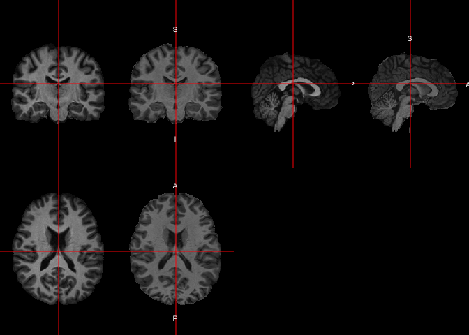<!-- --><!-- -->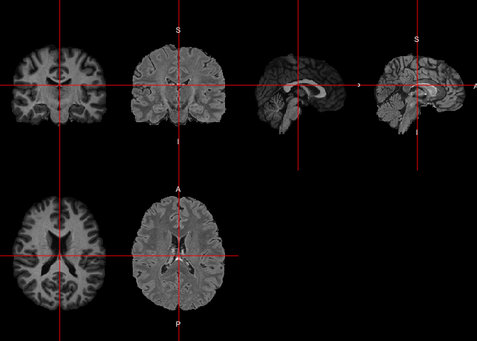<!-- -->

```
$T1
NULL

$T2
NULL

$FLAIR
NULL
```

We see good congruence from the template and the corresponding images from this patient.

## Getting the Eve atlas and labels

Here we will read in one of the whole brain atlases of Eve, specifically the type 2 ("II").  Please see @oishi2009atlas and @Oishi_Faria_Mori2010 for further discussion of the atlases.  We will read in the atlas and show that it has a series of integer labels.  These labels correspond to the `integer_label` column in the `data.frame` produced by `getEveMapLabels`.  


```r
eve_labels = readEveMap(type = "II")
unique_labs = eve_labels %>% 
  c %>% 
  unique %>% 
  sort 
head(unique_labs)
```

```
[1] 0 1 2 3 4 5
```

```r
lab_df = getEveMapLabels(type = "II")
head(unique(lab_df$integer_label))
```

```
[1] 0 1 2 3 4 5
```

```r
all( unique_labs %in% lab_df$integer_label)
```

```
[1] TRUE
```

## Plotting the labels
Let's plot the labels to see how they look. 


```r
ortho2(eve_labels)
```

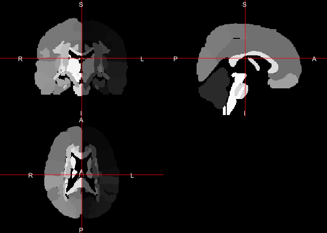<!-- -->

Although that shows us the breakdown of labels, the defaults in `ortho2` are for grayscale images.  Luckily, `getEveMapLabels` provides an rgb representation of a look up table (LUT) for colors for each structure.  Let's use that to plot the image:


```r
cols = rgb(lab_df$color_r/255, lab_df$color_g, 
           lab_df$color_b, maxColorValue = 255)
breaks = unique_labs
ortho2(eve_labels, col = cols, breaks = c(-1, breaks))
```

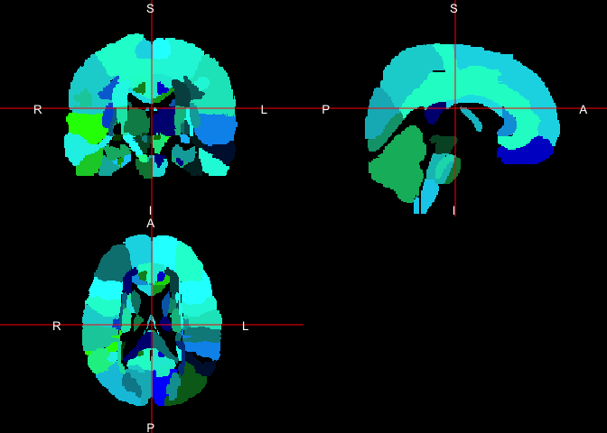<!-- -->

Again, not that great, but a bit better.  We can try our own palette as below:


```r
library(RColorBrewer)
rf <- colorRampPalette(rev(brewer.pal(11,'Spectral')))
cols <- rf(length(unique_labs))
ortho2(eve_labels, col = cols, breaks = c(-1, breaks))
```

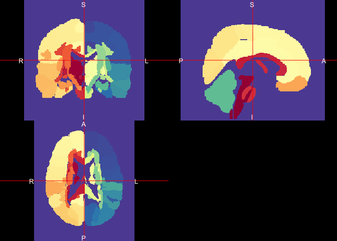<!-- -->
That may give us a good assortment of colors, where right is more red and blue is more left.  We can randomize these colors, which may show better discrepancy by putting those with a blue hue close to those with red:


```r
set.seed(20161008)
ortho2(eve_labels, col = sample(cols), breaks = c(-1, breaks))
```

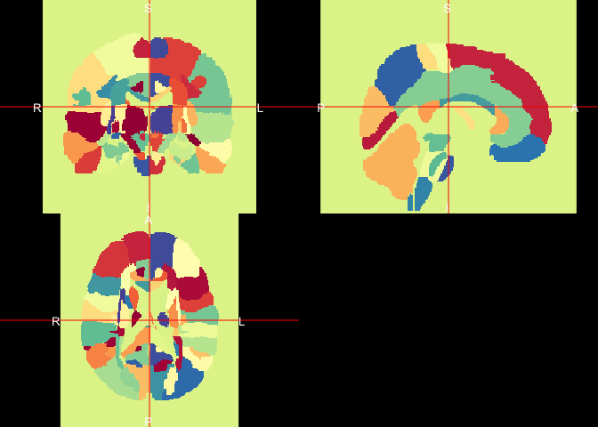<!-- -->

We can overlay these colors on top of the subject's T1 image:


```r
set.seed(20161008)
ortho2(norm_reg_imgs$T1, eve_labels, 
       col.y = alpha(sample(cols), 0.5), ybreaks = c(-1, breaks))
```

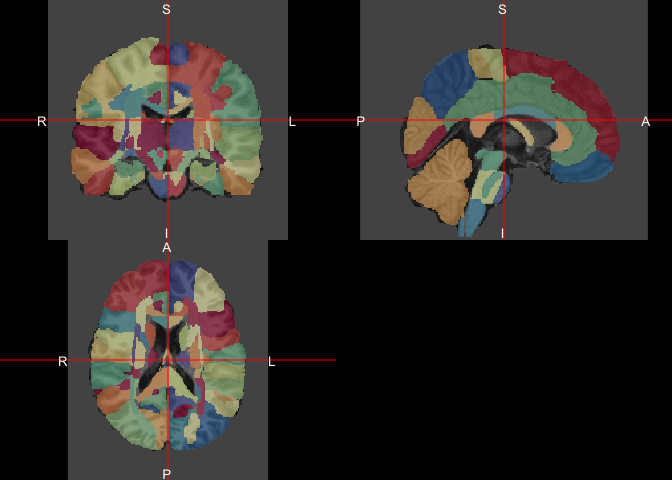<!-- -->

## Getting structure-specific metrics

Now that we have our normalized images in the template/atlas space, let's get information about each imaging sequence.  Here we will make a `data.frame` with all the voxels from each modality and the atlas.  There are more elegant ways to do this, but we want to be explicit below:


```r
df = data.frame(T1 = norm_reg_imgs$T1[ eve_brain_mask == 1],
                T2 = norm_reg_imgs$T2[ eve_brain_mask == 1],
                FLAIR = norm_reg_imgs$FLAIR[ eve_brain_mask == 1],
                integer_label = eve_labels[ eve_brain_mask == 1]
                )
```

Now that we have a standard `data.frame`, we can use any data manipulation procedure just as we would in any other way.  Let's reshape the data:


```r
library(reshape2)
library(dplyr)
long = reshape2::melt(df, 
                      id.vars = "integer_label")
head(long)
```

```
  integer_label variable        value
1           130       T1  0.000000000
2           130       T1  0.000000000
3            65       T1 -0.006485715
4           130       T1  0.000000000
5           130       T1 -0.033087343
6           130       T1 -0.046731040
```

Now we can merge in the labels from the Eve template so that we can actually see what structures these voxels represent.  We can drop the extraneous color columns as well.


```r
long = left_join(long, lab_df, by = "integer_label")
long = long %>% 
  select(-color_r, -color_g, -color_b)
```

Now we can calculate some statistics:

```r
stats = long %>% 
  group_by(integer_label, text_label, right_left, structure, variable) %>% 
  summarise(mean = mean(value),
            median = median(value),
            sd = sd(value)) %>% 
  select(variable, text_label, mean, median, sd, everything()) %>% 
  ungroup
head(stats)
```

```
# A tibble: 6 × 8
  variable                    text_label         mean      median
    <fctr>                         <chr>        <dbl>       <dbl>
1       T1                    background -0.606879821 -0.69270784
2       T2                    background  1.005639427  0.21436921
3    FLAIR                    background -0.660865609 -0.32353108
4       T1 superior_parietal_lobule_left  0.105027506  0.16597870
5       T2 superior_parietal_lobule_left  0.003699062 -0.38462870
6    FLAIR superior_parietal_lobule_left  0.037216124  0.03221552
# ... with 4 more variables: sd <dbl>, integer_label <dbl>,
#   right_left <chr>, structure <chr>
```


### Thalamus statistics

Let's look at the values corresponding to the thalamus:

```r
library(stringr)
stats %>% filter(str_detect(structure, "thalamus")) %>% 
  select(text_label, variable, mean) %>% 
  arrange(variable, text_label)
```

```
# A tibble: 6 × 3
      text_label variable        mean
           <chr>   <fctr>       <dbl>
1  thalamus_left       T1  0.80004855
2 thalamus_right       T1  0.78460175
3  thalamus_left       T2 -0.41903584
4 thalamus_right       T2 -0.39373081
5  thalamus_left    FLAIR  0.02892382
6 thalamus_right    FLAIR  0.05632016
```

### Thalamus distribution

Here we see that the thalamus has pretty consistent means for the left and the right across sequence.  But what about the distrubtion of all voxels in the thalamus?  

Here I'm going to define a helper function for a `ggplot2` plot, which makes legends transparent:


```r
transparent_legend =  theme(
  legend.background = element_rect(
    fill = "transparent"),
  legend.key = element_rect(fill =
                              "transparent", 
                            color = "transparent")
)
```

Let's go back to the `data.frame` `long` and plot the distribution of values for each sequence separated by left and right for the thamalus:


```r
 long %>% filter(str_detect(structure, "thalamus")) %>% 
  ggplot(aes(x = value, colour = factor(right_left))) + 
  geom_line(stat = "density") + facet_wrap(~variable, ncol = 1) +
    theme(legend.position = c(0.2, 0.5),
        legend.direction = "horizontal",
        text = element_text(size = 24)) +
  guides(colour = guide_legend(title = NULL)) +
  transparent_legend
```

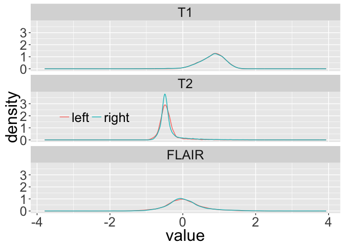<!-- -->

We can do similar things with boxplots:


```r
 long %>% filter(str_detect(structure, "thalamus")) %>% 
  ggplot(aes(x = variable, y = value, colour = factor(right_left))) + 
  geom_boxplot() +
    theme(legend.position = c(0.2, 0.85),
        legend.direction = "horizontal",
        text = element_text(size = 24)) +
  guides(colour = guide_legend(title = NULL)) +
  transparent_legend
```

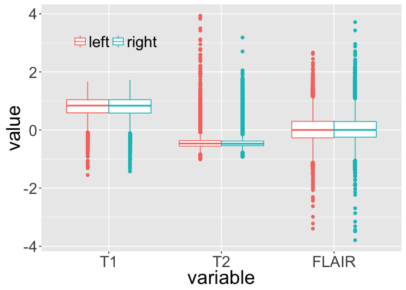<!-- -->


# Labels in native space

In the above section, we registered the subject's T1 image to the Eve template and performed all calculations and manipulations in the template space.  As the SyN registration uses an affine registration as well as a non-linear component, structures are scaled and rarely stay the same size.  If we want metrics of each structure, but in the **native space** (aka subject space), we can register the Eve brain to the subject space and apply the estimated transformation to the Eve atlas labels. 

## Registration of Eve to the subject T1

Here we will use the N4 corrected, processed images from [Processing Within-Visit MRI](../preprocess_mri_within/index.html) and register the Eve T1 brain to the processed T1 image.  Let us get the filenames that we want:


```r
eve_stub = "Eve_to_Subject"
outfile = paste0(eve_stub, "_T1.nii.gz")
lab_outfile = paste0(eve_stub, "_Labels.nii.gz")
outfiles = c(outfile, lab_outfile)

n4_files = file.path("..", 
                     "preprocess_mri_within", 
                     paste0("113-01-", mods, "_proc_N4_SS.nii.gz")
                     )
names(n4_files) = mods
```

Now we can register **Eve to the subject T1** (note this is the opposite from [Processing Within-Visit MRI](../preprocess_mri_within/index.html)).  We will use a `NearestNeighbor` interpolator here.  For the Eve brain image, this may not be a good interpolation and usually we would use a windowed sinc or linear interpolator.  

We are using `NearestNeighbor` here for the labels, so that after interpolation, the value of the voxel in subject space is from the nearest neighbor, which ensures that the label is a integer within the origninal set.  For example, let's say after registration, a voxel is near labels 1 and 5.  If we used an averaging interpolator (windowed sinc or linear), it may give the value of 3, which is an **entirely different label** and may not represent anything remotely close to correct.  Moreover, these are labels so the numbering is arbirtrary, categorical values.  Let's say we shuffled the labels on the Eve atlas (but kept track of the structures), then the atlas is exactly the same.  But if we applied the transformation to this shuffled atlas, the voxel may be near labels 420 and 6, which average to 120 or something.  Thus, we want the interpolation for the labels to result in picking from a label set, which we generall would use `NearestNeighbor` or `multiLabel`, see `antsApplyTransforms`.  


```r
if ( !all( file.exists(outfiles) )) {
  reg = extrantsr::registration(
    filename = eve_brain_fname,
    template.file = n4_files["T1"],
    other.files = eve_labels,
    other.outfiles = lab_outfile,
    interpolator = "NearestNeighbor",
    typeofTransform = "SyN")
} 
```

```
# Running Registration of file to template
```

```
# Applying Registration output is
```

```
$warpedmovout
antsImage
  Pixel Type          : float 
  Components Per Pixel: 1 
  Dimensions          : 111x172x132 
  Voxel Spacing       : 1.20000004768372x1x1 
  Origin              : 202.8 0 0 
  Direction           : -1 0 0 0 1 0 0 0 1 


$warpedfixout
antsImage
  Pixel Type          : float 
  Components Per Pixel: 1 
  Dimensions          : 181x217x181 
  Voxel Spacing       : 1x1x1 
  Origin              : 0 0 0 
  Direction           : 1 0 0 0 -1 0 0 0 1 


$fwdtransforms
[1] "/var/folders/1s/wrtqcpxn685_zk570bnx9_rr0000gr/T//RtmpmTGkqd/file1323515f9ef4e1Warp.nii.gz"      
[2] "/var/folders/1s/wrtqcpxn685_zk570bnx9_rr0000gr/T//RtmpmTGkqd/file1323515f9ef4e0GenericAffine.mat"

$invtransforms
[1] "/var/folders/1s/wrtqcpxn685_zk570bnx9_rr0000gr/T//RtmpmTGkqd/file1323515f9ef4e0GenericAffine.mat" 
[2] "/var/folders/1s/wrtqcpxn685_zk570bnx9_rr0000gr/T//RtmpmTGkqd/file1323515f9ef4e1InverseWarp.nii.gz"
```

```
# Applying Transformations to file
```

```
# Applying Transforms to other.files
```

```
# Writing out file
```

```
# Writing out other.files
```

```
# Removing Warping images
```

```
# Reading data back into R
```

Note, the `registration` function is somewhat limited as only one interpolator can be specified.  We could break the process into registration (with an averaging interpolator for the Eve brain) and then use `extrantsr::ants_apply_transforms` to apply this transformation to the Eve labels and use a nearest-neighbor interpolator.  This is how it is set up in `ANTsR` and the restriction of the `registration` function comes at the expense of having one function that performs registration and interpolation in one.  In this example, we don't care specifically about the registered-to-subject Eve template, so we don't break the process into two.


## Overlaying Native Eve Labels on T1

Here we will read in the output from the registered Eve labels:


```r
n4_proc_imgs = lapply(n4_files, readnii)
native_eve_labels = readnii(lab_outfile)
```

We will overlay the native Eve labels on top of the native-space N4 T1 images.   


```r
set.seed(20161008)
ortho2(n4_proc_imgs$T1, native_eve_labels, 
       col.y = alpha(sample(cols), 0.5), 
       ybreaks = c(-1, breaks))
```

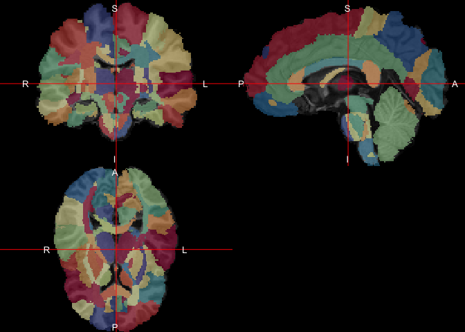<!-- -->


## Native `data.frame`


```r
native_mask = n4_proc_imgs$T1 > 0
norm_imgs = lapply(n4_proc_imgs, zscore_img, 
                   mask = native_mask)
native_df = data.frame(
  T1 = norm_imgs$T1[ native_mask == 1 ], 
  T2 = norm_imgs$T2[ native_mask == 1 ],
  FLAIR = norm_imgs$FLAIR[ native_mask == 1 ],
  integer_label = native_eve_labels[ native_mask == 1 ]
)
nlong = reshape2::melt(native_df, 
                      id.vars = "integer_label")
```

Now we can merge in the labels from the Eve template so that we can actually see what structures these voxels represent.  We can drop the extraneous color columns as well.


```r
nlong = left_join(nlong, lab_df, 
                  by = "integer_label")
nlong = nlong %>% 
  select(-color_r, -color_g, -color_b)
```


```r
g = nlong %>% filter(str_detect(structure, "thalamus")) %>% 
  ggplot(aes(x = value, colour = factor(right_left))) + 
  geom_line(stat = "density") + facet_wrap(~variable, ncol = 1) +
    theme(legend.position = c(0.2, 0.5),
        legend.direction = "horizontal",
        text = element_text(size = 24)) +
  guides(colour = guide_legend(title = NULL)) +
  transparent_legend
g + ggtitle("Native Space Thalamus")
```

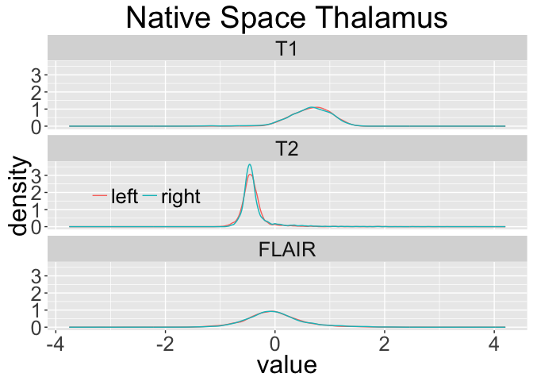<!-- -->

```r
(g + ggtitle("Eve Space Thalamus")) %+% 
  (nlong %>% filter(str_detect(structure, "thalamus")))
```

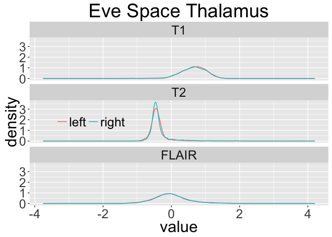<!-- -->

```r
rm(list = "g")
```

# Muti-atlas label fusion

There are multiple procedures that exist for labeling a native-space T1 image.  The registration of Eve to the native space image is an example of labeling with one atlas.  One of those procedures is taking a series of templates, with corresponding atlases, and registering these templates to the native space image and transforming the atlases as above.  

After registering these atlases, the procedure of combining these atlases into a final segmentation/labeling can be called fusion.  This multi-atlas, label fusion (MALF) is a general procedure where much methodological work has been in combining the labels (the fusion part).  The easiest method for combining these labels can be called simple voting, where the voxel label is designated by the label that has the maximum number of votes from each template.  

The `extrantsr::malf` function allows for a simple voting scheme with multi-atlas label fusion.


# Session Info


```r
devtools::session_info()
```

```
Session info --------------------------------------------------------------
```

```
 setting  value                       
 version  R version 3.3.1 (2016-06-21)
 system   x86_64, darwin13.4.0        
 ui       X11                         
 language (EN)                        
 collate  en_US.UTF-8                 
 tz       America/New_York            
 date     2016-11-11                  
```

```
Packages ------------------------------------------------------------------
```

```
 package       * version date       source                             
 abind           1.4-5   2016-07-21 cran (@1.4-5)                      
 ANTsR         * 0.3.3   2016-10-10 Github (stnava/ANTsR@a50e986)      
 assertthat      0.1     2013-12-06 CRAN (R 3.2.0)                     
 bitops          1.0-6   2013-08-17 CRAN (R 3.2.0)                     
 codetools       0.2-14  2015-07-15 CRAN (R 3.3.1)                     
 colorout      * 1.1-0   2015-04-20 Github (jalvesaq/colorout@1539f1f) 
 colorspace      1.2-6   2015-03-11 CRAN (R 3.2.0)                     
 DBI             0.5-1   2016-09-10 CRAN (R 3.3.0)                     
 devtools        1.12.0  2016-06-24 CRAN (R 3.3.0)                     
 digest          0.6.10  2016-08-02 cran (@0.6.10)                     
 dplyr         * 0.5.0   2016-06-24 CRAN (R 3.3.0)                     
 evaluate        0.9     2016-04-29 CRAN (R 3.2.5)                     
 EveTemplate   * 0.99.14 2016-09-15 local                              
 extrantsr     * 2.5.2   2016-11-10 local                              
 formatR         1.4     2016-05-09 CRAN (R 3.2.5)                     
 fslr            2.4.1   2016-11-10 local                              
 ggplot2       * 2.1.0   2016-03-01 CRAN (R 3.3.0)                     
 gtable          0.2.0   2016-02-26 CRAN (R 3.2.3)                     
 hash            2.2.6   2013-02-21 CRAN (R 3.2.0)                     
 htmltools       0.3.6   2016-09-26 Github (rstudio/htmltools@6996430) 
 igraph          1.0.1   2015-06-26 CRAN (R 3.2.0)                     
 iterators       1.0.8   2015-10-13 CRAN (R 3.2.0)                     
 kirby21.base  * 1.4.2   2016-10-05 local                              
 kirby21.flair   1.4     2016-09-29 local (@1.4)                       
 kirby21.smri  * 1.4     2016-09-30 local                              
 kirby21.t1      1.4     2016-09-29 local                              
 kirby21.t2      1.4     2016-09-29 local (@1.4)                       
 knitr           1.14    2016-08-13 CRAN (R 3.3.0)                     
 labeling        0.3     2014-08-23 CRAN (R 3.2.0)                     
 lattice         0.20-34 2016-09-06 CRAN (R 3.3.0)                     
 lazyeval        0.2.0   2016-06-12 CRAN (R 3.3.0)                     
 magrittr        1.5     2014-11-22 CRAN (R 3.2.0)                     
 Matrix          1.2-7.1 2016-09-01 CRAN (R 3.3.0)                     
 matrixStats     0.51.0  2016-10-09 cran (@0.51.0)                     
 memoise         1.0.0   2016-01-29 CRAN (R 3.2.3)                     
 mgcv            1.8-15  2016-09-14 CRAN (R 3.3.0)                     
 mmap            0.6-12  2013-08-28 CRAN (R 3.3.0)                     
 munsell         0.4.3   2016-02-13 CRAN (R 3.2.3)                     
 neurobase     * 1.5.1   2016-11-04 local                              
 neuroim         0.1.0   2016-09-27 local                              
 nlme            3.1-128 2016-05-10 CRAN (R 3.3.1)                     
 oro.nifti     * 0.6.2   2016-11-04 Github (bjw34032/oro.nifti@fe54c8e)
 plyr          * 1.8.4   2016-06-08 CRAN (R 3.3.0)                     
 R.matlab        3.6.0   2016-07-05 CRAN (R 3.3.0)                     
 R.methodsS3     1.7.1   2016-02-16 CRAN (R 3.2.3)                     
 R.oo            1.20.0  2016-02-17 CRAN (R 3.2.3)                     
 R.utils         2.4.0   2016-09-14 cran (@2.4.0)                      
 R6              2.2.0   2016-10-05 cran (@2.2.0)                      
 RColorBrewer  * 1.1-2   2014-12-07 CRAN (R 3.2.0)                     
 Rcpp            0.12.7  2016-09-05 cran (@0.12.7)                     
 reshape2      * 1.4.1   2014-12-06 CRAN (R 3.2.0)                     
 rmarkdown       1.1     2016-10-16 CRAN (R 3.3.1)                     
 RNifti          0.2.2   2016-10-02 cran (@0.2.2)                      
 scales          0.4.0   2016-02-26 CRAN (R 3.2.3)                     
 stringi         1.1.1   2016-05-27 CRAN (R 3.3.0)                     
 stringr       * 1.1.0   2016-08-19 cran (@1.1.0)                      
 tibble          1.2     2016-08-26 CRAN (R 3.3.0)                     
 WhiteStripe     2.0     2016-09-28 local                              
 withr           1.0.2   2016-06-20 CRAN (R 3.3.0)                     
 yaImpute        1.0-26  2015-07-20 CRAN (R 3.2.0)                     
 yaml            2.1.13  2014-06-12 CRAN (R 3.2.0)                     
```

# References
