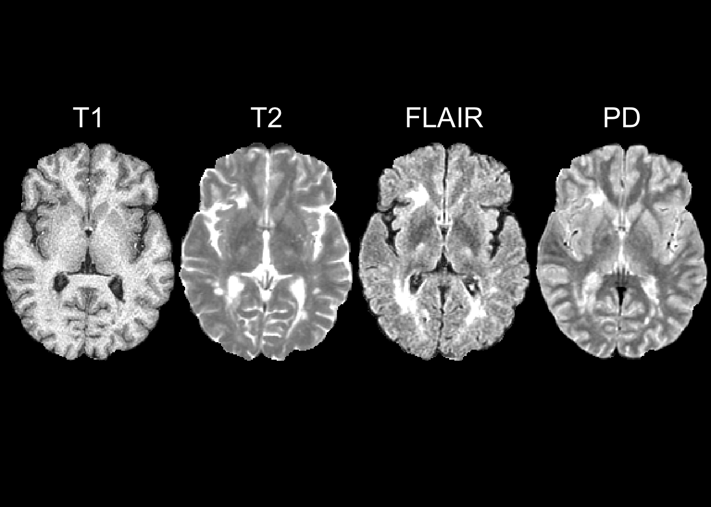
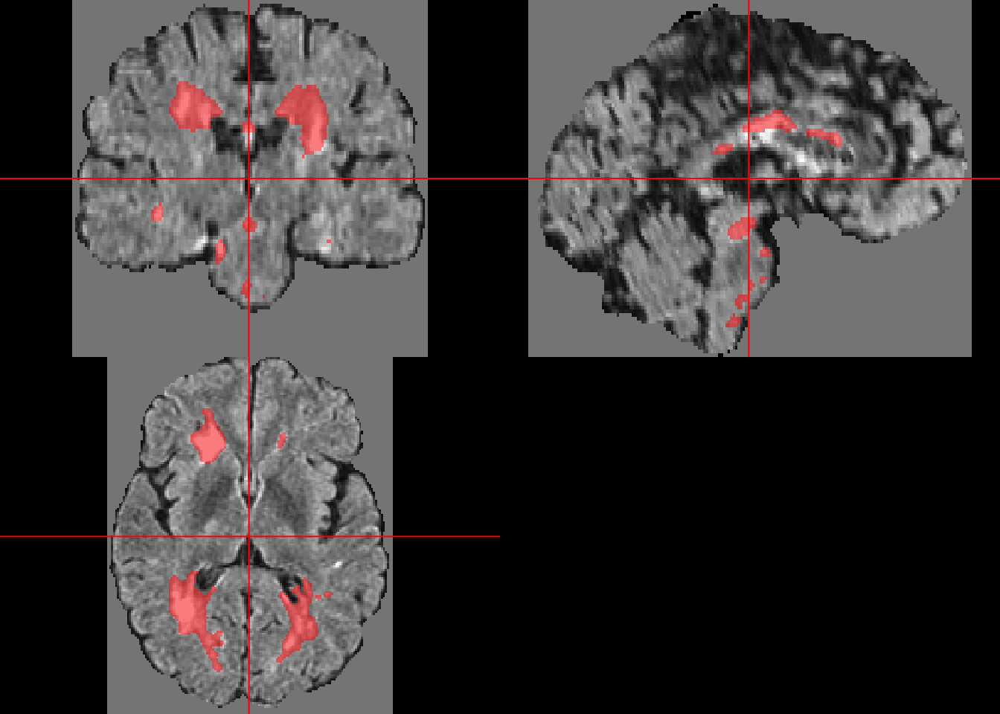
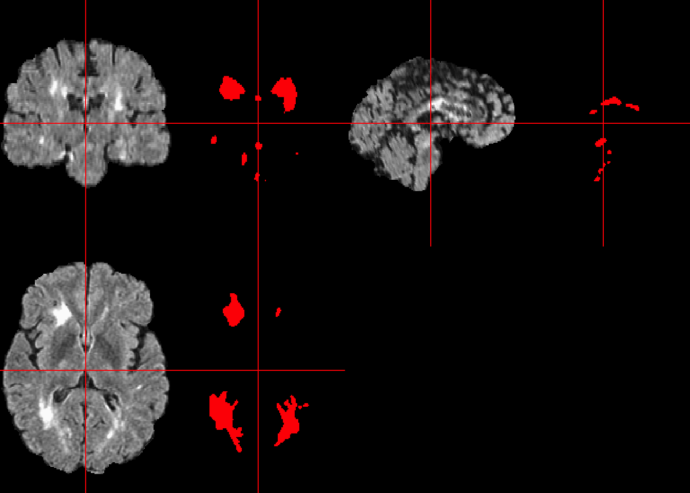
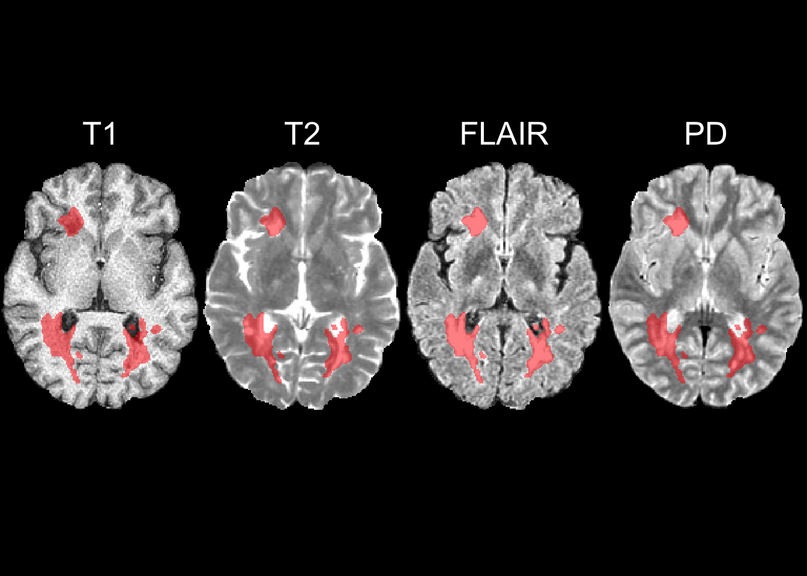

All code for this document is located at [here](https://raw.githubusercontent.com/muschellij2/neuroc/master/ms_lesion/index.R).


# Data

We will be using the data from the [2015 Longitudinal Multiple Sclerosis Lesion Segmentation Challenge](https://github.com/muschellij2/fslr_data).  The data consists of a single subject at 2 time points, baseline and followup.  The data is available for non-commercial purposes.  We will download the data from GitHub using the `git2r` package.

## Data Description

The data description was presented in @sweeney2013automatic.  The data in the folder was also discussed in @muschelli2015fslr.  It consists of one patient with multiple sclerosis (MS) with multi-sequence magnetic resonance imaging (MRI) data from 2 different time points.

## Package Version

Here we will be using the `oasis` package greater than version 2.2.  If you do not have this package and it's not located on CRAN yet, we will install it from GitHub.  


```r
library(dplyr)
loaded_package_version = function(pkg) {
  packs = devtools::session_info()$packages
  ver = packs %>% 
    filter(package %in% pkg) %>% 
    select(package, loadedversion)
  return(ver)
}
check_package_version = function(pkg, min_version){
  stopifnot(length(pkg) == 1)
  ver = loaded_package_version(pkg = pkg)
  ver = as.character(ver$loadedversion)
  min_version = as.character(min_version)
  # check to see if version is at least the min_version
  utils::compareVersion(a = ver, b = min_version) >= 0
}
check = check_package_version("oasis", min_version = "2.2")
if (!check) {
  source("https://neuroconductor.org/neurocLite.R")
  neuroc_install("oasis")  
}
```

There was a slight bug in `oasis_preproc` which needed to be corrected for the following code to work


<!-- # Converting the data -->

<!-- The data come in `nhdr`/`raw` image pairs, which are part of the [NRRD format](http://teem.sourceforge.net/nrrd/format.html).  The `ANTsR` package can read these in using `antsImageRead` and we cannot read them in as per usual using `readnii` or `readNIfTI`.  We will convert the images to `.nii.gz` files using the `extrantsr::c3d` command that wraps `antsImageRead` and `antsImageWrite`.   -->

<!-- For this example, we will assume you have copied all files into one directory called `data`: -->

<!-- ```{r readers, eval = FALSE} -->
<!-- library(extrantsr) -->
<!-- files = list.files(path = "data", pattern = "[.]nhdr") -->
<!-- sapply(files, function(infile) { -->
<!--   outfile = gsub("[.]nhdr$", ".nii.gz", infile) -->
<!--   c3d(infile, outfile) -->
<!-- }) -->
<!-- ``` -->

<!-- We can them remove any `nhdr`/`raw` pairs. -->

# Getting the data

We will use the `git2r` package to download the package into a folder called `data`.  The code below will clone the GitHub repository to the `data` folder, then delete the `.git` folder, which stores changes to the data, which can be a large file. We will also delete any processed data such as the brain mask and the skull-stripped image.


```r
library(git2r)
if (!dir.exists("data")) {
  repo = clone(url = "https://github.com/muschellij2/fslr_data",
      local_path = "data/")
  unlink(file.path("data/.git"), recursive = TRUE)
  file.remove(file.path("data", "SS_Image.nii.gz"))
  file.remove(file.path("data", "Brain_Mask.nii.gz"))
}
```

# Creating a filename `data.frame`

Here we will make a `data.frame` that has the imaging modality and the case number so we can sort or reorder if necessary:

```r
df = list.files(path = "data", 
                   pattern = "[.]nii[.]gz$", 
                   full.names = TRUE)
df = data.frame(file = df, stringsAsFactors = FALSE)
print(head(df))
```

```
                                             file
1              data/01-Baseline_Brain_Mask.nii.gz
2 data/01-Baseline_FLAIR_ants_preprocessed.nii.gz
3      data/01-Baseline_FLAIR_preprocessed.nii.gz
4                   data/01-Baseline_FLAIR.nii.gz
5           data/01-Baseline_N4_Brain_Mask.nii.gz
6    data/01-Baseline_PD_ants_preprocessed.nii.gz
```

We have the filenames in one column and will be doing some string manipulation to parse the information about the id and the modality/sequence:

```r
df$fname = nii.stub(df$file, bn = TRUE)
df$id = gsub("^(\\d\\d)-.*", "\\1", df$fname)
df$timepoint = gsub("^\\d\\d-(.*)_.*$", "\\1", df$fname)
df$modality = gsub("\\d\\d-.*_(.*)$", "\\1", df$fname)
print(unique(df$id))
```

```
[1] "01"
```

```r
print(unique(df$modality))
```

```
[1] "Mask"         "preprocessed" "FLAIR"        "PD"          
[5] "T1"           "T2"          
```

```r
print(head(df))
```

```
                                             file
1              data/01-Baseline_Brain_Mask.nii.gz
2 data/01-Baseline_FLAIR_ants_preprocessed.nii.gz
3      data/01-Baseline_FLAIR_preprocessed.nii.gz
4                   data/01-Baseline_FLAIR.nii.gz
5           data/01-Baseline_N4_Brain_Mask.nii.gz
6    data/01-Baseline_PD_ants_preprocessed.nii.gz
                                fname id           timepoint     modality
1              01-Baseline_Brain_Mask 01      Baseline_Brain         Mask
2 01-Baseline_FLAIR_ants_preprocessed 01 Baseline_FLAIR_ants preprocessed
3      01-Baseline_FLAIR_preprocessed 01      Baseline_FLAIR preprocessed
4                   01-Baseline_FLAIR 01            Baseline        FLAIR
5           01-Baseline_N4_Brain_Mask 01   Baseline_N4_Brain         Mask
6    01-Baseline_PD_ants_preprocessed 01    Baseline_PD_ants preprocessed
```

<!-- ## Multiple segmentation files -->

<!-- Here we see that there are 1 ids and a set of modalities.  We should also note that we have 2 separate lesion segmentations.  Each are from different readers.  We will use the segmentation from reader `1` for this analysis.  There are techniques such as label fusion that will allow you to combine multiple segmentations.  You can also use the voxel-wise mean of the segmentations.  Since there are only 2 segmentations here, however, after thresholding this mean, you are using a rule that says a voxel is a lesion if both agree or if at least one reader indicates that voxel is a lesion.   -->

<!-- Here we will remove the reader 2 segmentation and reorder the `data.frame` based on the ordering of the modalities.  -->

<!-- ```{r removing_chb} -->
<!-- df = df %>%  -->
<!--   filter(modality != "mask2") %>%  -->
<!--   mutate(modality = gsub("mask\\d", "mask", modality)) -->
<!-- df = df %>%  -->
<!--   mutate(modality =  -->
<!--            factor(modality,   -->
<!--                   levels = c("T1", "T2", "FLAIR", "PD", "mask"))) -->
<!-- df = df %>%  -->
<!--   arrange(id, modality) -->
<!-- ``` -->

# Cross-sectional MS Lesion Segmentation: OASIS package

The `oasis` package implements the pipeline from @sweeney2013oasis.  The package relies on `fslr` and therefore a working installation of FSL.  The package will perform the data preprocessing, train a model for lesion segmentation if gold-standard, manual segmentations are provided, and predict lesions from that model or the model from @sweeney2013oasis if no model (e.g. no gold standard) is provided.


```r
ss = split(df, df$timepoint)
ss = lapply(ss, function(x){
  mods = x$modality
  xx = x$file
  names(xx) = mods
  return(xx)
})
```

## Preprocessing

The preprocessing is performed using the `oasis_preproc` function.  It requires a T1, T2, and FLAIR image.  A proton density (PD) is not necessary, but the original OASIS model had PD and the model in the package relies on a PD image. 


```r
dat = ss[[1]]
print(dat)
```

```
                          FLAIR                              PD 
"data/01-Baseline_FLAIR.nii.gz"    "data/01-Baseline_PD.nii.gz" 
                             T1                              T2 
   "data/01-Baseline_T1.nii.gz"    "data/01-Baseline_T2.nii.gz" 
```

```r
# preparing output filenames
outfiles = nii.stub(dat)
brain_mask = gsub("_T1$", "", outfiles["T1"])
brain_mask = paste0(brain_mask, "_Brain_Mask.nii.gz")
outfiles = paste0(outfiles, "_preprocessed.nii.gz")
names(outfiles) = names(dat)
outfiles = c(outfiles, brain_mask = brain_mask)
outfiles = outfiles[ names(outfiles) != "mask"]

if (!all(file.exists(outfiles))) {
  pre = oasis_preproc(
    flair = dat["FLAIR"], 
    t1 = dat["T1"],
    t2 = dat["T2"],
    pd = dat["PD"],
    cores = 1)
  
  writenii(pre$t1, filename = outfiles["T1"])
  writenii(pre$t2, filename = outfiles["T2"])
  writenii(pre$flair, filename = outfiles["FLAIR"])
  writenii(pre$pd, filename = outfiles["PD"])
  writenii(pre$brain_mask, filename  = outfiles["brain_mask"])
}
```

## Review of the results

Here we will read in the output images and the brain mask.  We will normalize the image intensities using `zscore_img` so that the intensities are in the same scale range for plotting.   We will


```r
imgs = lapply(outfiles[c("T1", "T2", "FLAIR", "PD")], readnii)
brain_mask = readnii(outfiles["brain_mask"])
imgs = lapply(imgs, robust_window)
norm_imgs = lapply(imgs, zscore_img, margin = NULL, mask = brain_mask)
```

We will drop the empty image dimensions for plotting later.  We pass in the `mask` and the list of normalized images, remove the empty dimensions, and then we later re-mask the data

```r
dd = dropEmptyImageDimensions(brain_mask, other.imgs = norm_imgs)
red_mask = dd$outimg
norm_imgs = dd$other.imgs
norm_imgs = lapply(norm_imgs, mask_img, mask = red_mask)
```

Here we will show each imaging modality at the same slice:

```r
z = floor(nsli(norm_imgs[[1]])/2)
multi_overlay(
  norm_imgs, 
  z = z, 
  text = names(norm_imgs),
  text.x = 
    rep(0.5, length(norm_imgs)),
  text.y = 
    rep(1.4, length(norm_imgs)), 
  text.cex = 
    rep(2.5, length(norm_imgs)))
```

<!-- -->

We see that the registration seems to have performed well in that the same slice across sequences represent the same areas of the brain.

## Creating Predictors
Now that we've performed preprocessing of the data, we can create a dataset of these images whole-brain normalized and a series of smoothed images of the data.


```r
df_list = oasis_train_dataframe(
  flair = outfiles["FLAIR"],
  t1 = outfiles["T1"],
  t2 = outfiles["T2"],
  pd = outfiles["PD"],
  preproc = FALSE,
  brain_mask = outfiles["brain_mask"],
  eroder = "oasis")
```

```
Checking File inputs
```

```
Eroding Brain Mask
```

```
Normalizing Images using Z-score
```

```
Voxel Selection Procedure
```

```
Smoothing Images: Sigma = 10
```

```
fslmaths "/private/var/folders/1s/wrtqcpxn685_zk570bnx9_rr0000gr/T/RtmpGlq9Db/file9d0f70ef45de.nii.gz"  -s 10 "/var/folders/1s/wrtqcpxn685_zk570bnx9_rr0000gr/T//RtmpGlq9Db/file9d0f6cd42bbe";
```

```
fslmaths "/private/var/folders/1s/wrtqcpxn685_zk570bnx9_rr0000gr/T/RtmpGlq9Db/file9d0f5d83fec3.nii.gz"  -mas "/private/var/folders/1s/wrtqcpxn685_zk570bnx9_rr0000gr/T/RtmpGlq9Db/file9d0f4cae42c.nii.gz"  -s 10 "/var/folders/1s/wrtqcpxn685_zk570bnx9_rr0000gr/T//RtmpGlq9Db/file9d0f244a0729"; fslmaths "/var/folders/1s/wrtqcpxn685_zk570bnx9_rr0000gr/T//RtmpGlq9Db/file9d0f244a0729" -div "/private/var/folders/1s/wrtqcpxn685_zk570bnx9_rr0000gr/T/RtmpGlq9Db/file9d0f6cd42bbe.nii.gz" -mas "/private/var/folders/1s/wrtqcpxn685_zk570bnx9_rr0000gr/T/RtmpGlq9Db/file9d0f4cae42c.nii.gz" "/var/folders/1s/wrtqcpxn685_zk570bnx9_rr0000gr/T//RtmpGlq9Db/file9d0f244a0729";
```

```
fslmaths "/private/var/folders/1s/wrtqcpxn685_zk570bnx9_rr0000gr/T/RtmpGlq9Db/file9d0f781c275b.nii.gz"  -mas "/private/var/folders/1s/wrtqcpxn685_zk570bnx9_rr0000gr/T/RtmpGlq9Db/file9d0f5c04f8.nii.gz"  -s 10 "/var/folders/1s/wrtqcpxn685_zk570bnx9_rr0000gr/T//RtmpGlq9Db/file9d0f194a35f7"; fslmaths "/var/folders/1s/wrtqcpxn685_zk570bnx9_rr0000gr/T//RtmpGlq9Db/file9d0f194a35f7" -div "/private/var/folders/1s/wrtqcpxn685_zk570bnx9_rr0000gr/T/RtmpGlq9Db/file9d0f6cd42bbe.nii.gz" -mas "/private/var/folders/1s/wrtqcpxn685_zk570bnx9_rr0000gr/T/RtmpGlq9Db/file9d0f5c04f8.nii.gz" "/var/folders/1s/wrtqcpxn685_zk570bnx9_rr0000gr/T//RtmpGlq9Db/file9d0f194a35f7";
```

```
fslmaths "/private/var/folders/1s/wrtqcpxn685_zk570bnx9_rr0000gr/T/RtmpGlq9Db/file9d0f571cf819.nii.gz"  -mas "/private/var/folders/1s/wrtqcpxn685_zk570bnx9_rr0000gr/T/RtmpGlq9Db/file9d0f2ee45dfd.nii.gz"  -s 10 "/var/folders/1s/wrtqcpxn685_zk570bnx9_rr0000gr/T//RtmpGlq9Db/file9d0f12d6a518"; fslmaths "/var/folders/1s/wrtqcpxn685_zk570bnx9_rr0000gr/T//RtmpGlq9Db/file9d0f12d6a518" -div "/private/var/folders/1s/wrtqcpxn685_zk570bnx9_rr0000gr/T/RtmpGlq9Db/file9d0f6cd42bbe.nii.gz" -mas "/private/var/folders/1s/wrtqcpxn685_zk570bnx9_rr0000gr/T/RtmpGlq9Db/file9d0f2ee45dfd.nii.gz" "/var/folders/1s/wrtqcpxn685_zk570bnx9_rr0000gr/T//RtmpGlq9Db/file9d0f12d6a518";
```

```
fslmaths "/private/var/folders/1s/wrtqcpxn685_zk570bnx9_rr0000gr/T/RtmpGlq9Db/file9d0f49f0d451.nii.gz"  -mas "/private/var/folders/1s/wrtqcpxn685_zk570bnx9_rr0000gr/T/RtmpGlq9Db/file9d0f620337c3.nii.gz"  -s 10 "/var/folders/1s/wrtqcpxn685_zk570bnx9_rr0000gr/T//RtmpGlq9Db/file9d0f4142157a"; fslmaths "/var/folders/1s/wrtqcpxn685_zk570bnx9_rr0000gr/T//RtmpGlq9Db/file9d0f4142157a" -div "/private/var/folders/1s/wrtqcpxn685_zk570bnx9_rr0000gr/T/RtmpGlq9Db/file9d0f6cd42bbe.nii.gz" -mas "/private/var/folders/1s/wrtqcpxn685_zk570bnx9_rr0000gr/T/RtmpGlq9Db/file9d0f620337c3.nii.gz" "/var/folders/1s/wrtqcpxn685_zk570bnx9_rr0000gr/T//RtmpGlq9Db/file9d0f4142157a";
```

```
Smoothing Images: Sigma = 20
```

```
fslmaths "/private/var/folders/1s/wrtqcpxn685_zk570bnx9_rr0000gr/T/RtmpGlq9Db/file9d0f59901e0e.nii.gz"  -s 20 "/var/folders/1s/wrtqcpxn685_zk570bnx9_rr0000gr/T//RtmpGlq9Db/file9d0f4a55712";
```

```
fslmaths "/private/var/folders/1s/wrtqcpxn685_zk570bnx9_rr0000gr/T/RtmpGlq9Db/file9d0f2f76120.nii.gz"  -mas "/private/var/folders/1s/wrtqcpxn685_zk570bnx9_rr0000gr/T/RtmpGlq9Db/file9d0f3f097d65.nii.gz"  -s 20 "/var/folders/1s/wrtqcpxn685_zk570bnx9_rr0000gr/T//RtmpGlq9Db/file9d0f8079238"; fslmaths "/var/folders/1s/wrtqcpxn685_zk570bnx9_rr0000gr/T//RtmpGlq9Db/file9d0f8079238" -div "/private/var/folders/1s/wrtqcpxn685_zk570bnx9_rr0000gr/T/RtmpGlq9Db/file9d0f4a55712.nii.gz" -mas "/private/var/folders/1s/wrtqcpxn685_zk570bnx9_rr0000gr/T/RtmpGlq9Db/file9d0f3f097d65.nii.gz" "/var/folders/1s/wrtqcpxn685_zk570bnx9_rr0000gr/T//RtmpGlq9Db/file9d0f8079238";
```

```
fslmaths "/private/var/folders/1s/wrtqcpxn685_zk570bnx9_rr0000gr/T/RtmpGlq9Db/file9d0f29109ea6.nii.gz"  -mas "/private/var/folders/1s/wrtqcpxn685_zk570bnx9_rr0000gr/T/RtmpGlq9Db/file9d0f21fb95a.nii.gz"  -s 20 "/var/folders/1s/wrtqcpxn685_zk570bnx9_rr0000gr/T//RtmpGlq9Db/file9d0f70c1c4cc"; fslmaths "/var/folders/1s/wrtqcpxn685_zk570bnx9_rr0000gr/T//RtmpGlq9Db/file9d0f70c1c4cc" -div "/private/var/folders/1s/wrtqcpxn685_zk570bnx9_rr0000gr/T/RtmpGlq9Db/file9d0f4a55712.nii.gz" -mas "/private/var/folders/1s/wrtqcpxn685_zk570bnx9_rr0000gr/T/RtmpGlq9Db/file9d0f21fb95a.nii.gz" "/var/folders/1s/wrtqcpxn685_zk570bnx9_rr0000gr/T//RtmpGlq9Db/file9d0f70c1c4cc";
```

```
fslmaths "/private/var/folders/1s/wrtqcpxn685_zk570bnx9_rr0000gr/T/RtmpGlq9Db/file9d0f415f66e9.nii.gz"  -mas "/private/var/folders/1s/wrtqcpxn685_zk570bnx9_rr0000gr/T/RtmpGlq9Db/file9d0f5e5d6c86.nii.gz"  -s 20 "/var/folders/1s/wrtqcpxn685_zk570bnx9_rr0000gr/T//RtmpGlq9Db/file9d0f478001d0"; fslmaths "/var/folders/1s/wrtqcpxn685_zk570bnx9_rr0000gr/T//RtmpGlq9Db/file9d0f478001d0" -div "/private/var/folders/1s/wrtqcpxn685_zk570bnx9_rr0000gr/T/RtmpGlq9Db/file9d0f4a55712.nii.gz" -mas "/private/var/folders/1s/wrtqcpxn685_zk570bnx9_rr0000gr/T/RtmpGlq9Db/file9d0f5e5d6c86.nii.gz" "/var/folders/1s/wrtqcpxn685_zk570bnx9_rr0000gr/T//RtmpGlq9Db/file9d0f478001d0";
```

```
fslmaths "/private/var/folders/1s/wrtqcpxn685_zk570bnx9_rr0000gr/T/RtmpGlq9Db/file9d0f24f7235c.nii.gz"  -mas "/private/var/folders/1s/wrtqcpxn685_zk570bnx9_rr0000gr/T/RtmpGlq9Db/file9d0f5d327ff9.nii.gz"  -s 20 "/var/folders/1s/wrtqcpxn685_zk570bnx9_rr0000gr/T//RtmpGlq9Db/file9d0f1e6fe43c"; fslmaths "/var/folders/1s/wrtqcpxn685_zk570bnx9_rr0000gr/T//RtmpGlq9Db/file9d0f1e6fe43c" -div "/private/var/folders/1s/wrtqcpxn685_zk570bnx9_rr0000gr/T/RtmpGlq9Db/file9d0f4a55712.nii.gz" -mas "/private/var/folders/1s/wrtqcpxn685_zk570bnx9_rr0000gr/T/RtmpGlq9Db/file9d0f5d327ff9.nii.gz" "/var/folders/1s/wrtqcpxn685_zk570bnx9_rr0000gr/T//RtmpGlq9Db/file9d0f1e6fe43c";
```

```r
oasis_dataframe = df_list$oasis_dataframe
brain_mask = df_list$brain_mask
top_voxels = df_list$voxel_selection
```

We will use the model included in the `oasis` package since we do not currently have a gold standard.   After predicting, we smooth the probability map using adjacent voxel probabilities.  We then threshold this probability map to give a binary prediction of lesions.


```r
## make the model predictions
predictions = predict( oasis::oasis_model,
                        newdata = oasis_dataframe,
                        type = 'response')
pred_img = niftiarr(brain_mask, 0)
pred_img[top_voxels == 1] = predictions
library(fslr)
```

```

Attaching package: 'fslr'
```

```
The following object is masked from 'package:git2r':

    checkout
```

```r
##smooth the probability map
prob_map = fslsmooth(pred_img, sigma = 1.25,
                      mask = brain_mask, retimg = TRUE,
                      smooth_mask = TRUE)
```

```
fslmaths "/private/var/folders/1s/wrtqcpxn685_zk570bnx9_rr0000gr/T/RtmpGlq9Db/file9d0ff346219.nii.gz"  -mas "/private/var/folders/1s/wrtqcpxn685_zk570bnx9_rr0000gr/T/RtmpGlq9Db/file9d0f38145f1b.nii.gz"  -s 1.25 "/var/folders/1s/wrtqcpxn685_zk570bnx9_rr0000gr/T//RtmpGlq9Db/file9d0f41700260"; fslmaths "/private/var/folders/1s/wrtqcpxn685_zk570bnx9_rr0000gr/T/RtmpGlq9Db/file9d0f38145f1b.nii.gz" -s 1.25 "/var/folders/1s/wrtqcpxn685_zk570bnx9_rr0000gr/T//RtmpGlq9Db/file9d0f20ac0e30.nii.gz"; fslmaths "/var/folders/1s/wrtqcpxn685_zk570bnx9_rr0000gr/T//RtmpGlq9Db/file9d0f41700260" -div "/var/folders/1s/wrtqcpxn685_zk570bnx9_rr0000gr/T//RtmpGlq9Db/file9d0f20ac0e30.nii.gz" -mas "/private/var/folders/1s/wrtqcpxn685_zk570bnx9_rr0000gr/T/RtmpGlq9Db/file9d0f38145f1b.nii.gz" "/var/folders/1s/wrtqcpxn685_zk570bnx9_rr0000gr/T//RtmpGlq9Db/file9d0f41700260";
```

```r
threshold = 0.16
binary_map = prob_map > threshold
```

We can apply our empty-slice reduction from earlier so that the binary prediction and the normalized images are the same dimensions.  

We will overlay the predictions on the images and use the `alpha` function from the `scales` package to alpha-blend the intensities so we can see the underlying image as well as the areas delineated as lesion. 


```r
library(scales)

reduced_binary_map = apply_empty_dim(img = binary_map,
                                     inds = dd$inds)
ortho2(norm_imgs$FLAIR, reduced_binary_map,
       col.y = scales::alpha("red", 0.5))
```

<!-- -->

```r
double_ortho(norm_imgs$FLAIR, reduced_binary_map, col.y = "red")
```

<!-- -->

```r
multi_overlay(
  norm_imgs, 
  y = list(reduced_binary_map,
           reduced_binary_map,
           reduced_binary_map,
           reduced_binary_map),
  col.y = scales::alpha("red", 0.5) ,
  z = z, 
  text = names(norm_imgs),
  text.x = 
    rep(0.5, length(norm_imgs)),
  text.y = 
    rep(1.4, length(norm_imgs)), 
  text.cex = 
    rep(2.5, length(norm_imgs)))
```

<!-- -->


## Analagous preprocessing with ANTsR and extrantsr

Although the original OASIS model was done using FSL, we can perform preprocessing in ANTsR if we later would like to train a model based on this preprocessing.  Note, the original model may not work well as it may be specific to the preprocessing done in FSL.


```r
check = check_package_version("extrantsr", min_version = "2.2.1")
if (!check) {
  source("https://neuroconductor.org/neurocLite.R")
  neuroc_install("extrantsr") 
}
```


```r
dat = ss[[1]]
print(dat)
```

```
                          FLAIR                              PD 
"data/01-Baseline_FLAIR.nii.gz"    "data/01-Baseline_PD.nii.gz" 
                             T1                              T2 
   "data/01-Baseline_T1.nii.gz"    "data/01-Baseline_T2.nii.gz" 
```

```r
# preparing output filenames
ants_outfiles = nii.stub(dat)
n4_brain_mask = gsub("_T1$", "", ants_outfiles["T1"])
n4_brain_mask = paste0(n4_brain_mask, "_N4_Brain_Mask.nii.gz")
ants_outfiles = paste0(ants_outfiles, "_ants_preprocessed.nii.gz")
names(ants_outfiles) = names(dat)
ants_outfiles = ants_outfiles[ names(ants_outfiles) != "mask"]

if (!all(file.exists(ants_outfiles))) {
  pre = preprocess_mri_within(
    files = dat[c("T1", "T2", "FLAIR", "PD")],
    outfiles = ants_outfiles[c("T1", "T2", "FLAIR", "PD")],
    correct = TRUE,
    correction = "N4",
    skull_strip = FALSE,
    typeofTransform = "Rigid",
    interpolator = "LanczosWindowedSinc")
  
  ss = fslbet_robust(
    ants_outfiles["T1"], 
    correct = FALSE,
    bet.opts = "-v")
  ss = ss > 0
  writenii(ss, filename = n4_brain_mask)
  
  imgs = lapply(ants_outfiles[c("T1", "T2", "FLAIR", "PD")],
                readnii)
  imgs = lapply(imgs, mask_img, ss)
  
  imgs = lapply(imgs, bias_correct, correction = "N4",
                mask = ss)
  mapply(function(img, fname){
    writenii(img, filename = fname)
  }, imgs, ants_outfiles[c("T1", "T2", "FLAIR", "PD")])
  
}
```


```r
L = oasis_train_dataframe(
  flair = ants_outfiles["FLAIR"],
  t1 = ants_outfiles["T1"],
  t2 = ants_outfiles["T2"],
  pd = ants_outfiles["PD"],
  preproc = FALSE,
  brain_mask = n4_brain_mask,
  eroder = "oasis")

ants_oasis_dataframe = L$oasis_dataframe
ants_brain_mask = L$brain_mask
ants_top_voxels = L$voxel_selection
```

```r
library(cluster)
km = kmeans(x = ants_oasis_dataframe, centers = 4)
km_img = niftiarr(ants_brain_mask, 0)
km_img[ants_top_voxels == 1] = km$cluster
n4_flair = readnii(ants_outfiles["FLAIR"])
res = clara(x = ants_oasis_dataframe, k = 4)
cl_img = niftiarr(ants_brain_mask, 0)
cl_img[ants_top_voxels == 1] = res$clustering
ortho2(n4_flair, cl_img > 3, col.y = scales::alpha("red", 0.5))
```

# References
