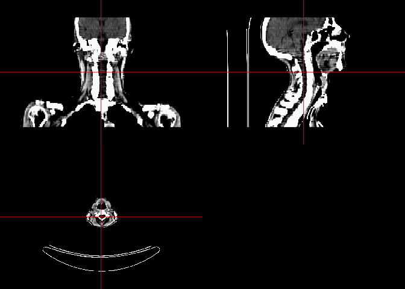
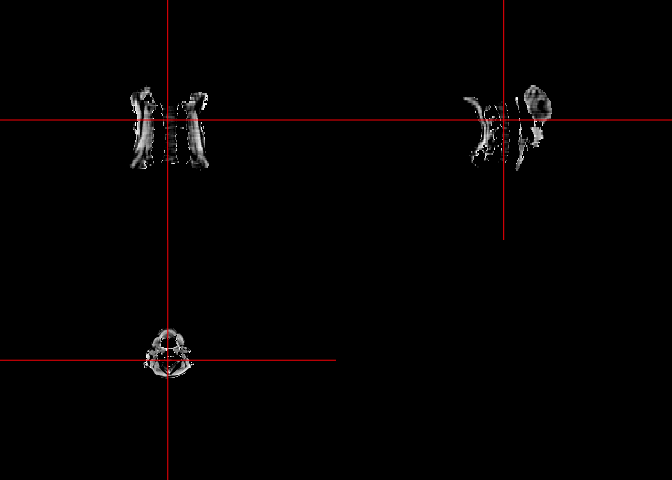
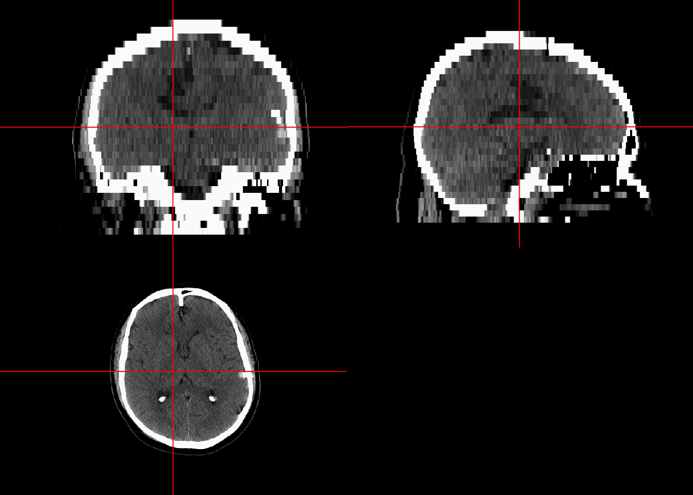
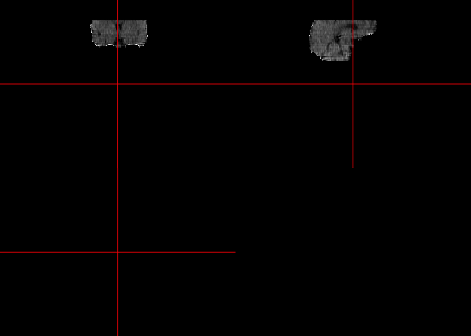
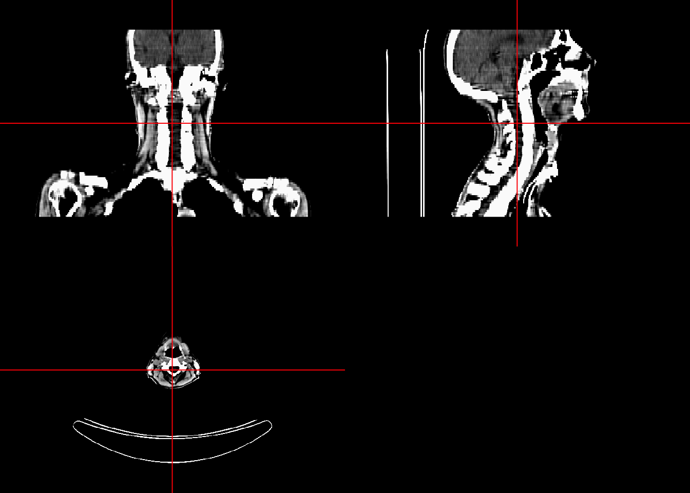

All code for this document is located at [here](https://raw.githubusercontent.com/muschellij2/neuroc/master/ss_ct/index.R).


# Goal
In this tutorial, we will discuss skull-stripping (or brain-extracting) x_ray computed tomography (CT) scans.  We will use data from TCIA (http://www.cancerimagingarchive.net/) as there is a great package called [`TCIApathfinder`](https://CRAN.R-project.org/package=TCIApathfinder) to interface with TCIA.

## Using TCIApathfinder

In order to use `TCIApathfinder`, please see the [vignette to obtain API keys](https://cran.r-project.org/web/packages/TCIApathfinder/vignettes/introduction.html).  Here we will look at the collections:


```r
library(TCIApathfinder)
library(dplyr)
collections = get_collection_names()
collections = collections$collection_names
head(collections)
```

```
[1] "4D-Lung"               "Anti-PD-1_Lung"        "Anti-PD-1_MELANOMA"   
[4] "APOLLO"                "BREAST-DIAGNOSIS"      "Breast-MRI-NACT-Pilot"
```

```r
mods = get_modality_names(body_part = "BREAST")
head(mods$mods)
```

```
NULL
```

## Getting Body Part Information
Here we can see all the parts of the body examined.


```r
bp = get_body_part_names()
bp$body_parts
```

```
 [1] "ABDOMEN"         "BD CT ABD WO_W " "BLADDER"        
 [4] "BRAIN"           "BREAST"          "CAROTID"        
 [7] "CERVIX"          "CHEST"           "CHEST_ABDOMEN"  
[10] "CHEST_TO_PELVIS" "CHESTABDPELVIS"  "COLON"          
[13] "CT CHEST WO CE"  "CT THORAX W CNT" "ESOPHAGUS"      
[16] "EXTREMITY"       "FUSION"          "HEAD"           
[19] "HEADNECK"        "HEART"           "J brzuszna"     
[22] "J BRZUSZNA"      "Kidney"          "KIDNEY"         
[25] "LEG"             "LIVER"           "LUMBO-SACRAL SP"
[28] "LUNG"            "MEDIASTINUM"     "NECK"           
[31] "OVARY"           "PANCREAS"        "PELVIS"         
[34] "Phantom"         "PHANTOM"         "PROSTATE"       
[37] "RECTUM"          "SEG"             "SELLA"          
[40] "SKULL"           "STOMACH"         "TH CT CHEST WO "
[43] "THORAX_1HEAD_NE" "THYROID"         "TSPINE"         
[46] "UNDEFINED"       "UTERUS"         
```

Particularly, these areas are of interest.  There seems to be a "bug" in `TCIApathfinder::get_series_info` which is acknowledged in the help file.  Namely, the `body_part_examined` is not always a parameter to be set.  We could get all the series info for all the collections from the code below, but it takes some times (> 15 minutes):

```r
# could look for any of these
get_bp = c("BRAIN", "HEAD", "HEADNECK")

# takes a long time
res = pbapply::pblapply(collections, function(collection) {
  x = get_series_info(
    collection = collection, 
    modality = "CT")
  x$series
})
```

## Getting Series

Here we will gather the series information for a study we know to have head CT data:


```r
collection = "CPTAC-GBM"
series = get_series_info(
  collection = collection, 
  modality = "CT")
series = series$series
head(series)
```

```
  patient_id collection
1         NA  CPTAC-GBM
2         NA  CPTAC-GBM
3         NA  CPTAC-GBM
4         NA  CPTAC-GBM
5         NA  CPTAC-GBM
6         NA  CPTAC-GBM
                                                study_instance_uid
1 1.3.6.1.4.1.14519.5.2.1.2857.3707.221249410799063035815783816913
2 1.3.6.1.4.1.14519.5.2.1.2857.3707.221249410799063035815783816913
3 1.3.6.1.4.1.14519.5.2.1.2857.3707.221249410799063035815783816913
4 1.3.6.1.4.1.14519.5.2.1.2857.3707.170705714007862724678123629040
5 1.3.6.1.4.1.14519.5.2.1.2857.3707.170705714007862724678123629040
6 1.3.6.1.4.1.14519.5.2.1.2857.3707.170705714007862724678123629040
                                               series_instance_uid
1 1.3.6.1.4.1.14519.5.2.1.2857.3707.100565015879506080275493644685
2 1.3.6.1.4.1.14519.5.2.1.2857.3707.176470763322052742670285487681
3 1.3.6.1.4.1.14519.5.2.1.2857.3707.272098545527401893663335969793
4 1.3.6.1.4.1.14519.5.2.1.2857.3707.254723691164851053423448594844
5 1.3.6.1.4.1.14519.5.2.1.2857.3707.531177247834252562951224965872
6 1.3.6.1.4.1.14519.5.2.1.2857.3707.225513954801691101397384975174
  modality                           protocol_name series_date
1       CT         1.6 CTA HEAD WITH WAND PROTOCOL  2001-01-15
2       CT         1.6 CTA HEAD WITH WAND PROTOCOL  2001-01-15
3       CT         1.6 CTA HEAD WITH WAND PROTOCOL  2001-01-15
4       CT 1.8 CTV HEAD Auto Transfer 75mL Iso 300  2001-01-23
5       CT 1.8 CTV HEAD Auto Transfer 75mL Iso 300  2001-01-23
6       CT 1.8 CTV HEAD Auto Transfer 75mL Iso 300  2001-01-23
  series_description body_part_examined series_number annotations_flag
1     SAG 10 X 2 MIP               <NA>    603.000000               NA
2      AX 10 X 2 MIP               <NA>    601.000000               NA
3      COR10 X 2 MIP               <NA>    602.000000               NA
4            CTV COR               <NA>    602.000000               NA
5            CTV SAG               <NA>    603.000000               NA
6          CTV AXIAL               <NA>    601.000000               NA
        manufacturer manufacturer_model_name software_versions image_count
1 GE MEDICAL SYSTEMS          LightSpeed VCT              <NA>          93
2 GE MEDICAL SYSTEMS          LightSpeed VCT              <NA>         124
3 GE MEDICAL SYSTEMS          LightSpeed VCT              <NA>         101
4 GE MEDICAL SYSTEMS          LightSpeed VCT              <NA>         107
5 GE MEDICAL SYSTEMS          LightSpeed VCT              <NA>          89
6 GE MEDICAL SYSTEMS          LightSpeed VCT              <NA>          53
```

Here we grab the first series ID from this data which has a description of "HEAD STD" for standard head:


```r
std_head = series %>% 
  filter(grepl("HEAD STD", series_description))
series_instance_uid = std_head$series_instance_uid[1]

download_unzip_series = function(series_instance_uid,
                                 verbose = TRUE) {
  tdir = tempfile()
  dir.create(tdir, recursive = TRUE)
  tfile = tempfile(fileext = ".zip")
  tfile = basename(tfile)
  if (verbose) {
    message("Downloading Series")
  }
  res = save_image_series(
    series_instance_uid = series_instance_uid, 
    out_dir = tdir, 
    out_file_name = tfile)
  if (verbose) {
    message("Unzipping Series")
  }  
  stopifnot(file.exists(res$out_file))
  tdir = tempfile()
  dir.create(tdir, recursive = TRUE)
  res = unzip(zipfile = res$out_file  , exdir = tdir)
  L = list(files = res,
           dirs = unique(dirname(normalizePath(res))))
  return(L)
}
# Download and unzip the image series

file_list = download_unzip_series(
  series_instance_uid = series_instance_uid)
```

```
Downloading Series
```

```
Unzipping Series
```


```r
library(dcm2niir)
dcm_result = dcm2nii(file_list$dirs)
```

```
#Copying Files
```

```
# Converting to nii 
```

```
'/Library/Frameworks/R.framework/Versions/3.5/Resources/library/dcm2niir/dcm2niix' -9 -z y -f %p_%t_%s '/var/folders/1s/wrtqcpxn685_zk570bnx9_rr0000gr/T//Rtmpocd8lW/file712d54e5650e'
```

```r
result = check_dcm2nii(dcm_result)
```


```r
library(neurobase)
img = readnii(result)
ortho2(img)
```

<!-- -->

```r
range(img)
```

```
[1] -3024  3071
```


```r
img = rescale_img(img, min.val = -1024, max.val = 3071)
ortho2(img)
```

<!-- -->

```r
ortho2(img, window = c(0, 100))
```

<!-- -->


## Skull Strip

We can skull strip the image using `CT_Skull_Strip` or `CT_Skull_Stripper`.  The `CT_Skull_Stripper` has a simple switch to use `CT_Skull_Strip` or `CT_Skull_Strip_robust`.  

```r
library(ichseg)
ss = CT_Skull_Strip(img, verbose = FALSE)
```

```
fslmaths "/private/var/folders/1s/wrtqcpxn685_zk570bnx9_rr0000gr/T/RtmpuPbDe5/file83b0184d2c54.nii.gz" -thr 0.000000 -uthr 100.000000  "/var/folders/1s/wrtqcpxn685_zk570bnx9_rr0000gr/T//RtmpuPbDe5/file83b07f2bdb56"
```

```
fslmaths "/var/folders/1s/wrtqcpxn685_zk570bnx9_rr0000gr/T//RtmpuPbDe5/file83b07f2bdb56"  -abs "/var/folders/1s/wrtqcpxn685_zk570bnx9_rr0000gr/T//RtmpuPbDe5/file83b072994b42";
```

```
fslmaths "/var/folders/1s/wrtqcpxn685_zk570bnx9_rr0000gr/T//RtmpuPbDe5/file83b072994b42" -bin -fillh "/var/folders/1s/wrtqcpxn685_zk570bnx9_rr0000gr/T//RtmpuPbDe5/file83b02e1c14d5"
```

```
fslmaths "/var/folders/1s/wrtqcpxn685_zk570bnx9_rr0000gr/T//RtmpuPbDe5/file83b07f2bdb56"  -s 1 "/var/folders/1s/wrtqcpxn685_zk570bnx9_rr0000gr/T//RtmpuPbDe5/file83b07f2bdb56";
```

```
fslmaths "/var/folders/1s/wrtqcpxn685_zk570bnx9_rr0000gr/T//RtmpuPbDe5/file83b07f2bdb56" -mas "/var/folders/1s/wrtqcpxn685_zk570bnx9_rr0000gr/T//RtmpuPbDe5/file83b02e1c14d5"  "/var/folders/1s/wrtqcpxn685_zk570bnx9_rr0000gr/T//RtmpuPbDe5/file83b07f2bdb56"
```

```
bet2 "/var/folders/1s/wrtqcpxn685_zk570bnx9_rr0000gr/T//RtmpuPbDe5/file83b07f2bdb56" "/var/folders/1s/wrtqcpxn685_zk570bnx9_rr0000gr/T//RtmpuPbDe5/file83b07f2bdb56" -f 0.01 -v
```

```
fslmaths "/var/folders/1s/wrtqcpxn685_zk570bnx9_rr0000gr/T//RtmpuPbDe5/file83b07f2bdb56"  -abs "/var/folders/1s/wrtqcpxn685_zk570bnx9_rr0000gr/T//RtmpuPbDe5/file83b0359bc399";
```

```
fslmaths "/var/folders/1s/wrtqcpxn685_zk570bnx9_rr0000gr/T//RtmpuPbDe5/file83b0359bc399" -bin -fillh "/var/folders/1s/wrtqcpxn685_zk570bnx9_rr0000gr/T//RtmpuPbDe5/file83b07f2bdb56_Mask"
```

```
fslmaths "/private/var/folders/1s/wrtqcpxn685_zk570bnx9_rr0000gr/T/RtmpuPbDe5/file83b05468d4e.nii.gz" -mas "/var/folders/1s/wrtqcpxn685_zk570bnx9_rr0000gr/T//RtmpuPbDe5/file83b07f2bdb56_Mask"  "/var/folders/1s/wrtqcpxn685_zk570bnx9_rr0000gr/T//RtmpuPbDe5/file83b07f2bdb56"
```

```r
ortho2(img, ss > 0, 
       window = c(0, 100),
       col.y = scales::alpha("red", 0.5))
```

<!-- -->

The `CT_Skull_Strip_robust` function does 2 neck removals using `remove_neck` from `extrantsr` and then find the center of gravity (COG) twice to make sure the segmentation focuses on the head.  In some instances, the whole neck is included in the scan, such as some of the head-neck studies in TCIA.


# Showing a Robust Example with the neck

## Getting Series

Here we will gather the series information for the `Head-Neck Cetuximab` collection:


```r
collection = "Head-Neck Cetuximab"
series = get_series_info(
  collection = collection, 
  modality = "CT")
series = series$series
whole_body = series %>% 
  filter(grepl("WB", series_description))
```


```r
file_list = download_unzip_series(
  series_instance_uid = series$series_instance_uid[1])
```

```
Downloading Series
```

```
Unzipping Series
```


```r
dcm_result = dcm2nii(file_list$dirs, merge_files = TRUE)
```

```
#Copying Files
```

```
# Converting to nii 
```

```
'/Library/Frameworks/R.framework/Versions/3.5/Resources/library/dcm2niir/dcm2niix' -9  -m y -z y -f %p_%t_%s '/var/folders/1s/wrtqcpxn685_zk570bnx9_rr0000gr/T//RtmpuPbDe5/file83b02cae0714'
```

```r
result = check_dcm2nii(dcm_result)
```


```r
img = readnii(result)
img = rescale_img(img, min.val = -1024, max.val = 3071)
ortho2(img, window = c(0, 100))
```

<!-- -->


```r
ss_wb = CT_Skull_Strip(img, verbose = FALSE)
```

```
fslmaths "/private/var/folders/1s/wrtqcpxn685_zk570bnx9_rr0000gr/T/RtmpuPbDe5/file83b01a8426d2.nii.gz" -thr 0.000000 -uthr 100.000000  "/var/folders/1s/wrtqcpxn685_zk570bnx9_rr0000gr/T//RtmpuPbDe5/file83b07d541266"
```

```
fslmaths "/var/folders/1s/wrtqcpxn685_zk570bnx9_rr0000gr/T//RtmpuPbDe5/file83b07d541266"  -abs "/var/folders/1s/wrtqcpxn685_zk570bnx9_rr0000gr/T//RtmpuPbDe5/file83b05a10b297";
```

```
fslmaths "/var/folders/1s/wrtqcpxn685_zk570bnx9_rr0000gr/T//RtmpuPbDe5/file83b05a10b297" -bin -fillh "/var/folders/1s/wrtqcpxn685_zk570bnx9_rr0000gr/T//RtmpuPbDe5/file83b07e3d05b2"
```

```
fslmaths "/var/folders/1s/wrtqcpxn685_zk570bnx9_rr0000gr/T//RtmpuPbDe5/file83b07d541266"  -s 1 "/var/folders/1s/wrtqcpxn685_zk570bnx9_rr0000gr/T//RtmpuPbDe5/file83b07d541266";
```

```
fslmaths "/var/folders/1s/wrtqcpxn685_zk570bnx9_rr0000gr/T//RtmpuPbDe5/file83b07d541266" -mas "/var/folders/1s/wrtqcpxn685_zk570bnx9_rr0000gr/T//RtmpuPbDe5/file83b07e3d05b2"  "/var/folders/1s/wrtqcpxn685_zk570bnx9_rr0000gr/T//RtmpuPbDe5/file83b07d541266"
```

```
bet2 "/var/folders/1s/wrtqcpxn685_zk570bnx9_rr0000gr/T//RtmpuPbDe5/file83b07d541266" "/var/folders/1s/wrtqcpxn685_zk570bnx9_rr0000gr/T//RtmpuPbDe5/file83b07d541266" -f 0.01 -v
```

```
fslmaths "/var/folders/1s/wrtqcpxn685_zk570bnx9_rr0000gr/T//RtmpuPbDe5/file83b07d541266"  -abs "/var/folders/1s/wrtqcpxn685_zk570bnx9_rr0000gr/T//RtmpuPbDe5/file83b0584129dd";
```

```
fslmaths "/var/folders/1s/wrtqcpxn685_zk570bnx9_rr0000gr/T//RtmpuPbDe5/file83b0584129dd" -bin -fillh "/var/folders/1s/wrtqcpxn685_zk570bnx9_rr0000gr/T//RtmpuPbDe5/file83b07d541266_Mask"
```

```
fslmaths "/private/var/folders/1s/wrtqcpxn685_zk570bnx9_rr0000gr/T/RtmpuPbDe5/file83b01e23996f.nii.gz" -mas "/var/folders/1s/wrtqcpxn685_zk570bnx9_rr0000gr/T//RtmpuPbDe5/file83b07d541266_Mask"  "/var/folders/1s/wrtqcpxn685_zk570bnx9_rr0000gr/T//RtmpuPbDe5/file83b07d541266"
```

```r
ortho2(ss_wb, window = c(0, 100))
```

<!-- -->


```r
ss_wb_robust = CT_Skull_Stripper(img, verbose = FALSE, robust = TRUE)
```

```
# Registration to template
```

```
# Swapping Dimensions 
```

```
fslhd "/private/var/folders/1s/wrtqcpxn685_zk570bnx9_rr0000gr/T/RtmpuPbDe5/file83b05c6295c2.nii.gz" 
```

```
fslorient -getorient "/private/var/folders/1s/wrtqcpxn685_zk570bnx9_rr0000gr/T/RtmpuPbDe5/file83b05c6295c2.nii.gz"
```

```
fslswapdim "/private/var/folders/1s/wrtqcpxn685_zk570bnx9_rr0000gr/T/RtmpuPbDe5/file83b05c6295c2.nii.gz"  RL PA IS "/var/folders/1s/wrtqcpxn685_zk570bnx9_rr0000gr/T//RtmpuPbDe5/file83b02b0fe1b7";
```

```
# Running Registration of file to template
```

```
# Applying Registration output is
```

```
$warpedmovout
antsImage
  Pixel Type          : float 
  Components Per Pixel: 1 
  Dimensions          : 512x512x107 
  Voxel Spacing       : 1.12000000476837x1.12000000476837x3 
  Origin              : -286.72 285.6 61 
  Direction           : 1 0 0 0 -1 0 0 0 1 


$warpedfixout
antsImage
  Pixel Type          : float 
  Components Per Pixel: 1 
  Dimensions          : 181x217x181 
  Voxel Spacing       : 1x1x1 
  Origin              : 90 125 -71 
  Direction           : -1 0 0 0 -1 0 0 0 1 


$fwdtransforms
[1] "/var/folders/1s/wrtqcpxn685_zk570bnx9_rr0000gr/T//RtmpuPbDe5/file83b047bb01df0GenericAffine.mat"

$invtransforms
[1] "/var/folders/1s/wrtqcpxn685_zk570bnx9_rr0000gr/T//RtmpuPbDe5/file83b047bb01df0GenericAffine.mat"

$prev_transforms
character(0)
```

```
# Applying Transformations to file
```

```
# Applying Transforms to other.files
```

```
# Writing out file
```

```
# Writing out other.files
```

```
# Removing Warping images
```

```
# Reading data back into R
```

```
# Reading in Transformed data
```

```
# Dropping slices not in mask
```

```
# Swapping Dimensions Back
```

```
fslswapdim "/private/var/folders/1s/wrtqcpxn685_zk570bnx9_rr0000gr/T/RtmpuPbDe5/file83b01f6299a8.nii.gz"  RL PA IS "/var/folders/1s/wrtqcpxn685_zk570bnx9_rr0000gr/T//RtmpuPbDe5/file83b0255f4b1";
```

```
# Thresholding Image to 0-100
```

```
fslmaths "/private/var/folders/1s/wrtqcpxn685_zk570bnx9_rr0000gr/T/RtmpuPbDe5/file83b0593391a9.nii.gz" -thr 0.000000 -uthr 100.000000  "/var/folders/1s/wrtqcpxn685_zk570bnx9_rr0000gr/T//RtmpuPbDe5/file83b027077c12"
```

```
# Thresholding return: 0
```

```
# Absolute value so fslmaths -bin keeps all mask even if lthres < 0
```

```
fslmaths "/var/folders/1s/wrtqcpxn685_zk570bnx9_rr0000gr/T//RtmpuPbDe5/file83b027077c12"  -abs "/var/folders/1s/wrtqcpxn685_zk570bnx9_rr0000gr/T//RtmpuPbDe5/file83b048a01bff";
```

```
# Abs return: /var/folders/1s/wrtqcpxn685_zk570bnx9_rr0000gr/T//RtmpuPbDe5/file83b048a01bff.nii.gz
```

```
# Creating 0 - 100 mask to remask after filling
```

```
fslmaths "/var/folders/1s/wrtqcpxn685_zk570bnx9_rr0000gr/T//RtmpuPbDe5/file83b048a01bff" -bin -fillh "/var/folders/1s/wrtqcpxn685_zk570bnx9_rr0000gr/T//RtmpuPbDe5/file83b078e2799"
```

```
# Presmoothing image
```

```
fslmaths "/var/folders/1s/wrtqcpxn685_zk570bnx9_rr0000gr/T//RtmpuPbDe5/file83b027077c12"  -s 1 "/var/folders/1s/wrtqcpxn685_zk570bnx9_rr0000gr/T//RtmpuPbDe5/file83b027077c12";
```

```
# Pre Smoothing Diagnostic: 0
```

```
# Remasking Smoothed Image
```

```
fslmaths "/var/folders/1s/wrtqcpxn685_zk570bnx9_rr0000gr/T//RtmpuPbDe5/file83b027077c12" -mas "/var/folders/1s/wrtqcpxn685_zk570bnx9_rr0000gr/T//RtmpuPbDe5/file83b078e2799"  "/var/folders/1s/wrtqcpxn685_zk570bnx9_rr0000gr/T//RtmpuPbDe5/file83b027077c12"
```

```
# Pre Smoothing Diagnostic: 0
```

```
# Running bet2
```

```
bet2 "/var/folders/1s/wrtqcpxn685_zk570bnx9_rr0000gr/T//RtmpuPbDe5/file83b027077c12" "/var/folders/1s/wrtqcpxn685_zk570bnx9_rr0000gr/T//RtmpuPbDe5/file83b027077c12" -f  0.01 
```

```
# bet2 output: 0
```

```
# Using fslfill to fill in any holes in mask 
```

```
fslmaths "/var/folders/1s/wrtqcpxn685_zk570bnx9_rr0000gr/T//RtmpuPbDe5/file83b027077c12"  -abs "/var/folders/1s/wrtqcpxn685_zk570bnx9_rr0000gr/T//RtmpuPbDe5/file83b05c9b1af";
```

```
fslmaths "/var/folders/1s/wrtqcpxn685_zk570bnx9_rr0000gr/T//RtmpuPbDe5/file83b05c9b1af" -bin -fillh "/var/folders/1s/wrtqcpxn685_zk570bnx9_rr0000gr/T//RtmpuPbDe5/file83b027077c12_Mask"
```

```
# fslfill output: 0
```

```
# Using the filled mask to mask original image
```

```
fslmaths "/private/var/folders/1s/wrtqcpxn685_zk570bnx9_rr0000gr/T/RtmpuPbDe5/file83b0593391a9.nii.gz" -mas "/var/folders/1s/wrtqcpxn685_zk570bnx9_rr0000gr/T//RtmpuPbDe5/file83b027077c12_Mask"  "/var/folders/1s/wrtqcpxn685_zk570bnx9_rr0000gr/T//RtmpuPbDe5/file83b027077c12"
```

```
# Thresholding Image to 0-100
```

```
fslmaths "/private/var/folders/1s/wrtqcpxn685_zk570bnx9_rr0000gr/T/RtmpuPbDe5/file83b0593391a9.nii.gz" -thr 0.000000 -uthr 100.000000  "/var/folders/1s/wrtqcpxn685_zk570bnx9_rr0000gr/T//RtmpuPbDe5/file83b027077c12"
```

```
# Thresholding return: 0
```

```
# Absolute value so fslmaths -bin keeps all mask even if lthres < 0
```

```
fslmaths "/var/folders/1s/wrtqcpxn685_zk570bnx9_rr0000gr/T//RtmpuPbDe5/file83b027077c12"  -abs "/var/folders/1s/wrtqcpxn685_zk570bnx9_rr0000gr/T//RtmpuPbDe5/file83b07cb05b20";
```

```
# Abs return: /var/folders/1s/wrtqcpxn685_zk570bnx9_rr0000gr/T//RtmpuPbDe5/file83b07cb05b20.nii.gz
```

```
# Creating 0 - 100 mask to remask after filling
```

```
fslmaths "/var/folders/1s/wrtqcpxn685_zk570bnx9_rr0000gr/T//RtmpuPbDe5/file83b07cb05b20" -bin -fillh "/var/folders/1s/wrtqcpxn685_zk570bnx9_rr0000gr/T//RtmpuPbDe5/file83b01e2ed1d4"
```

```
# Presmoothing image
```

```
fslmaths "/var/folders/1s/wrtqcpxn685_zk570bnx9_rr0000gr/T//RtmpuPbDe5/file83b027077c12"  -s 1 "/var/folders/1s/wrtqcpxn685_zk570bnx9_rr0000gr/T//RtmpuPbDe5/file83b027077c12";
```

```
# Pre Smoothing Diagnostic: 0
```

```
# Remasking Smoothed Image
```

```
fslmaths "/var/folders/1s/wrtqcpxn685_zk570bnx9_rr0000gr/T//RtmpuPbDe5/file83b027077c12" -mas "/var/folders/1s/wrtqcpxn685_zk570bnx9_rr0000gr/T//RtmpuPbDe5/file83b01e2ed1d4"  "/var/folders/1s/wrtqcpxn685_zk570bnx9_rr0000gr/T//RtmpuPbDe5/file83b027077c12"
```

```
# Pre Smoothing Diagnostic: 0
```

```
# Running bet2
```

```
bet2 "/var/folders/1s/wrtqcpxn685_zk570bnx9_rr0000gr/T//RtmpuPbDe5/file83b027077c12" "/var/folders/1s/wrtqcpxn685_zk570bnx9_rr0000gr/T//RtmpuPbDe5/file83b027077c12" -f  0.01  -w  2 -c 261 272 79
```

```
# bet2 output: 0
```

```
# Using fslfill to fill in any holes in mask 
```

```
fslmaths "/var/folders/1s/wrtqcpxn685_zk570bnx9_rr0000gr/T//RtmpuPbDe5/file83b027077c12"  -abs "/var/folders/1s/wrtqcpxn685_zk570bnx9_rr0000gr/T//RtmpuPbDe5/file83b013d1c4c7";
```

```
fslmaths "/var/folders/1s/wrtqcpxn685_zk570bnx9_rr0000gr/T//RtmpuPbDe5/file83b013d1c4c7" -bin -fillh "/var/folders/1s/wrtqcpxn685_zk570bnx9_rr0000gr/T//RtmpuPbDe5/file83b027077c12_Mask"
```

```
# fslfill output: 0
```

```
# Using the filled mask to mask original image
```

```
fslmaths "/private/var/folders/1s/wrtqcpxn685_zk570bnx9_rr0000gr/T/RtmpuPbDe5/file83b0593391a9.nii.gz" -mas "/var/folders/1s/wrtqcpxn685_zk570bnx9_rr0000gr/T//RtmpuPbDe5/file83b027077c12_Mask"  "/var/folders/1s/wrtqcpxn685_zk570bnx9_rr0000gr/T//RtmpuPbDe5/file83b027077c12"
```

```
Dimension of kernel is 11x11x11
Creating Kernel fft
Creating Image fft
Convolution
Shifting
Dimension of kernel is 11x11x11
Creating Kernel fft
Creating Image fft
Convolution
Shifting
```

```
fslmaths "/private/var/folders/1s/wrtqcpxn685_zk570bnx9_rr0000gr/T/RtmpuPbDe5/file83b0164044ef.nii.gz" -bin -fillh "/var/folders/1s/wrtqcpxn685_zk570bnx9_rr0000gr/T//RtmpuPbDe5/file83b02004b9c5"
```

```r
ortho2(ss_wb_robust, window = c(0, 100))
```

<!-- -->


# The website data
We could also look at the website, but these do not always correspond to the API and get all the necessary results.


```r
library(rvest)
```

```
Loading required package: xml2
```

```r
library(dplyr)
x = read_html("http://www.cancerimagingarchive.net/")
tab = html_table(x)[[1]]
head_tab = tab %>% 
  filter(grepl("Head|Brain", Location),
         grepl("CT", Modalities), 
         Access == "Public")
brain_tab = tab %>% 
  filter(grepl("Brain", Location),
         grepl("CT", Modalities), 
         Access == "Public")
brain_tab
```

```
  Collection             Cancer Type Modalities Subjects Location
1  CPTAC-GBM Glioblastoma Multiforme     CT, MR       32    Brain
2     IvyGAP            Glioblastoma     MR, CT       39    Brain
3   TCGA-LGG        Low Grade Glioma     MR, CT      199    Brain
4   TCGA-GBM Glioblastoma Multiforme MR, CT, DX      262    Brain
  Supporting Data Access   Status    Updated
1             Yes Public  Ongoing 2018/10/26
2             Yes Public Complete 2016/12/30
3             Yes Public Complete 2014/09/04
4             Yes Public Complete 2014/05/08
```

In `brain_tab`, we see we have a few collections.  We are going to use the collection Head-Neck Cetuximab from above.

## Getting Patient Information

We could sample patients from the collection here and get the patient information:


```r
set.seed(20181203)

patients = get_patient_info(collection = collection)
info = patients$patients
head(info)
```

```
  patient_id patient_name patient_dob patient_sex patient_ethnic_group
1  0522c0001    0522c0001          NA           F                   NA
2  0522c0002    0522c0002          NA           M                   NA
3  0522c0003    0522c0003          NA           M                   NA
4  0522c0009    0522c0009          NA           M                   NA
5  0522c0013    0522c0013          NA           M                   NA
6  0522c0070    0522c0070          NA           M                   NA
           collection
1 Head-Neck Cetuximab
2 Head-Neck Cetuximab
3 Head-Neck Cetuximab
4 Head-Neck Cetuximab
5 Head-Neck Cetuximab
6 Head-Neck Cetuximab
```

Though we are not guaranteed the data will have Brain CT data.  We will use the `series` variable to grab a relevant scan.

